# Authentication

## Context

The platform supports multiple authentication methods: SIWE wallet login (via RainbowKit) and OAuth providers (GitHub, Discord, Google). All providers resolve to a canonical `user_id` (UUID) via the `user_bindings` table. Wallet-session coherence is enforced for SIWE users. OAuth-only users have `walletAddress: null` and cannot access wallet-gated operations (payments, ledger approval).

Machine bearer tokens use the same canonical user identity. A valid
`cogni_ag_sk_v1_*` token resolves to `SessionUser.id = user_id` and
`walletAddress = null`; it does not create an agent principal by itself.

## Goal

Provide multi-provider authentication on NextAuth v4 with JWT strategy. SIWE wallet users retain strict disconnect-on-switch behavior. OAuth users get clean onboarding. Account linking allows authenticated users to bind additional providers to their existing identity.

## Non-Goals

- Email/password authentication
- Apple OAuth (P2 — requires team ID, key ID, private key file)
- Custom SIWE message creation (uses RainbowKit SIWE adapter)
- Auth.js v5 migration (RainbowKit SIWE incompatible — defer until supported)
- DrizzleAdapter (JWT strategy + user_bindings is sufficient)
- Merge/conflict resolution for duplicate identities (P1)

## Core Invariants

1. **WALLET_SESSION_COHERENCE**: Disconnecting or switching the wallet invalidates the SIWE session. If the wallet disconnects, the session is signed out. If the wallet switches to a different address, the session is signed out. (SIWE users only.)

2. **CANONICAL_IS_USER_ID**: `user_id` (UUID) is the canonical identity for all attribution, billing, and session operations. `walletAddress` is an optional attribute (`string | null`), not the identity.

3. **RAINBOWKIT_ADAPTER_ONLY**: SIWE authentication uses the stock RainbowKit SIWE adapter. No bespoke SIWE message creation or custom signature flows.

4. **IDENTITIES_ARE_BINDINGS**: Every login method resolves via `user_bindings(provider, external_id)`. SIWE = `provider="wallet"`, GitHub = `provider="github"`, Discord = `provider="discord"`, Google = `provider="google"`.

5. **LINKING_IS_EXPLICIT**: Account linking requires an active session. New OAuth login with unknown `external_id` creates a new user. `UNIQUE(provider, external_id)` prevents same account bound to two users (NO_AUTO_MERGE).

6. **WALLET_GATED_OPS**: Payment creation and ledger approval require `walletAddress`. OAuth-only users (`walletAddress: null`) receive clean 403 responses.

7. **LINK_IS_FAIL_CLOSED**: If a link flow was initiated (link_intent cookie present) but cannot be verified (expired, consumed, invalid JWT, DB transaction missing), the signIn callback rejects with `/profile?error=link_failed`. Never falls through to new-user creation.

8. **SINGLE_ROUTING_AUTHORITY**: Server (`src/proxy.ts` + RSC redirects) is the routing authority for access control. Client may initiate navigation after client-side auth completion (SIWE) to trigger server routing — see `AuthRedirect` on public pages.

9. **REQUEST_IDENTITY_UNIFIED**: API routes that import `getSessionUser` from `@/app/_lib/auth/session` accept either a browser session cookie or a valid HMAC machine bearer token. A presented but invalid bearer token returns no identity and does not fall back to cookies.

10. **RBAC_ACTOR_IS_USER_ID**: For direct user and user-bound machine execution, runtime RBAC uses `actorId = user:{user_id}`. Wallet addresses, OAuth provider IDs, and bearer token strings are bindings/credentials, not RBAC actors.

## Design

### Auth Flows

```mermaid
graph TD
    subgraph "SIWE Wallet Login (unchanged)"
        W1[RainbowKit Connect] --> W2[SIWE Verify]
        W2 --> W3[users lookup by wallet_address]
        W3 --> W4[createBinding 'wallet', address]
        W4 --> W5["JWT { id, walletAddress }"]
    end

    subgraph "OAuth Login (GitHub/Discord/Google)"
        O1[NextAuth OAuth redirect] --> O2[signIn callback]
        O2 --> O3{user_bindings lookup}
        O3 -->|binding exists| O4[Return existing user.id]
        O3 -->|no binding| O5[Atomic tx: user + binding + event]
        O4 --> O6["JWT { id, walletAddress: null }"]
        O5 --> O6
    end

    subgraph "Account Linking (DB-backed, fail-closed)"
        L1[Authenticated user] --> L2["POST /api/auth/link/{provider}"]
        L2 --> L3[Insert linkTransactions row]
        L3 --> L4[Set signed JWT cookie with txId]
        L4 --> L5["Client calls signIn(provider)"]
        L5 --> L6[Decode JWT → pending or failed intent]
        L6 --> L7{Atomic consume: UPDATE WHERE unconsumed + unexpired}
        L7 -->|row returned| L8["createBinding for existing user"]
        L7 -->|no row| L9["Reject → /profile?error=link_failed"]
    end
```



**SIWE login** uses the stock RainbowKit SIWE adapter with 2-step UX (wallet connect + SIWE signature). Unchanged from pre-OAuth.

**OAuth login** resolves users via `user_bindings(provider, external_id)`. Returning users get their existing `user_id`. New users get an atomic transaction creating `users` + `user_bindings` + `identity_events` rows. Race-safe: concurrent first-logins for the same external_id roll back the losing transaction and re-fetch the winner.

**Account linking** uses a DB-backed `linkTransactions` table for fail-closed verification. The link endpoint inserts a transaction row, then sets a signed JWT cookie containing `{ txId, userId, purpose: "link_intent" }` with 5-minute TTL, scoped to `Path=/api/auth/callback`. On OAuth callback routes only, the `[...nextauth]` handler decodes the JWT and passes a pending or failed intent via `AsyncLocalStorage` to the `signIn` callback. Non-callback NextAuth routes (`/providers`, `/session`, `/signout`) ignore the cookie entirely. The callback atomically consumes the transaction (`UPDATE ... WHERE id = $txId AND user_id = $userId AND provider = $provider AND consumedAt IS NULL AND expiresAt > now() RETURNING *`). The `provider` match prevents cross-provider replay (a transaction created for GitHub cannot be consumed by a Discord callback). If consumption fails (expired, already consumed, wrong provider, tampered), the link is rejected — never falls through to new-user creation. The `linkTransactions` table uses `getServiceDb()` (BYPASSRLS) because the session is not settled during the OAuth callback.

### SessionUser Type

```typescript
interface SessionUser {
  id: string; // users.id (UUID) — canonical identity
  walletAddress: string | null; // null for OAuth-only users
  displayName: string | null; // from user_profiles (loaded into JWT on sign-in)
  avatarColor: string | null; // from user_profiles (loaded into JWT on sign-in)
}
```

`displayName` and `avatarColor` are loaded from `user_profiles` into the JWT on initial sign-in and on explicit `session.update()` calls. They are not re-fetched on every request.

### Machine Bearer Tokens

Agent API keys are HMAC-signed bearer tokens with prefix `cogni_ag_sk_v1_`.
`resolveRequestIdentity()` verifies the signature and expiry, then returns a
`SessionUser` whose `id` is the token payload `sub`.

Bearer-token behavior:

- A valid token authenticates API routes that use the shared `getSessionUser` alias.
- An invalid presented token returns `null`; the request does not fall back to a browser session.
- The token subject is a `user_id`, so downstream RBAC receives `actorId = user:{user_id}`.
- The token is not an OpenFGA delegation grant. `agent:{id}` and `subjectId` require server-issued execution grants.
- For external AI agents, registration authenticates the agent but does not
  authorize node operations. Node developer flight authority is granted by a
  node creator/admin through `POST /api/v1/nodes/{node_id}/developers`, stored
  in OpenFGA, and enforced by `POST /api/v1/vcs/flight` as `node.flight` on
  `node:{node_id}`.

### Post-Auth Redirect

The `redirect` callback in `src/auth.ts` routes authenticated users:

- Default post-sign-in (`/`) → `/chat`
- Relative URLs → allowed (prefixed with `baseUrl`)
- Same-origin URLs → allowed
- Cross-origin URLs → blocked (returns `baseUrl`)

For SIWE, RainbowKit uses `signIn("credentials", { redirect: false })`, so this callback does not fire. SIWE post-auth redirect is handled client-side (see task.0112).

### Sign-In Routing

NextAuth `pages.signIn` points to `/` (landing page). Sign-in is a modal dialog (`SignInDialog`) triggered from the header's `WalletConnectButton`, not a standalone page. Auth routing is enforced server-side in `src/proxy.ts`:

- Authenticated users on `/` → redirect to `/chat`
- Unauthenticated users on app routes (`/chat`, `/profile`, etc.) → redirect to `/`
- `getToken()` (Edge-compatible JWT check) called once per request

### OAuth Provider Registration

Providers register conditionally — only when both `CLIENT_ID` and `CLIENT_SECRET` env vars are non-empty. Missing credentials = provider not shown in SignInDialog or on profile page. Both `SignInDialog` and the profile page fetch `/api/auth/providers` at runtime to discover configured providers.

### Known UX Limitations (MVP-Tolerated)

**SIWE sign-in has two steps:** MetaMask "Connect this website" + RainbowKit "Verify your account" modal. Planned fix: Custom ConnectButton that auto-triggers SIWE after connection.

**No session-only sign-out:** "Disconnect" removes wallet permission entirely. Planned fix: Separate "Sign out" (clears NextAuth session) and "Disconnect wallet" actions.

### File Pointers

| File                                                | Purpose                                                                                         |
| --------------------------------------------------- | ----------------------------------------------------------------------------------------------- |
| `src/auth.ts`                                       | NextAuth config: providers, signIn/jwt/session callbacks, link tx helpers                       |
| `src/proxy.ts`                                      | Server-side auth routing (single authority for redirects)                                       |
| `src/app/api/auth/[...nextauth]/route.ts`           | Route handler: JWT decode → pending/failed intent via AsyncLocalStorage                         |
| `src/app/api/auth/link/[provider]/route.ts`         | Link initiation: DB insert + signed JWT cookie + redirect                                       |
| `src/app/_lib/auth/request-identity.ts`             | Unified browser-session / HMAC bearer-token request identity resolver                           |
| `src/shared/auth/link-intent-store.ts`              | Discriminated union types + AsyncLocalStorage for link intent propagation                       |
| `src/shared/auth/session.ts`                        | SessionUser type (id, walletAddress, displayName, avatarColor)                                  |
| `packages/db-schema/src/identity.ts`                | `linkTransactions` table schema (alongside user_bindings, identity_events)                      |
| `src/components/kit/auth/SignInDialog.tsx`          | Modal dialog: wallet + OAuth sign-in options                                                    |
| `src/components/kit/auth/WalletConnectButton.tsx`   | Opens SignInDialog; SIWE fallback state                                                         |
| `src/components/kit/data-display/ProviderIcons.tsx` | Shared SVG icons (Ethereum, GitHub, Discord, Google)                                            |
| `src/lib/auth/server.ts`                            | `getServerSessionUser()` — requires only `id`                                                   |
| `nodes/<node>/app/src/app/providers.client.tsx`     | RainbowKit + SIWE provider wiring (WagmiProvider outermost, hydrated via `initialState`)        |
| `nodes/<node>/app/src/app/layout.tsx`               | Server-component root: `cookieToInitialState(wagmiConfig, cookie)` → `<Providers initialState>` |
| `src/features/payments/errors.ts`                   | `WalletRequiredError` for null-wallet payment guard                                             |

## Acceptance Checks

**Manual:**

1. SIWE wallet login → session has `id` + `walletAddress` (unchanged)
2. Switch wallet address → session invalidated (WALLET_SESSION_COHERENCE)
3. Disconnect wallet → session destroyed
4. GitHub/Discord/Google OAuth login → new user, session has `id`, `walletAddress` is null
5. Same OAuth login again → same user returned (idempotent via user_bindings)
6. Logged in with wallet → "Link GitHub" → OAuth → `/profile?linked=github`, binding created
7. Attempt to link account already bound to different user → `/profile?error=already_linked` (NO_AUTO_MERGE)
8. Link with expired/consumed transaction → `/profile?error=link_failed` (LINK_IS_FAIL_CLOSED)
9. OAuth-only user hits payment endpoint → clean 403
10. `identity_events` has `bind` event for each provider link
11. Unauthenticated user on `/chat` → redirected to `/` (proxy)
12. Authenticated user on `/` → redirected to `/chat` (proxy)
13. SignInDialog shows only configured providers (fetches `/api/auth/providers`)
14. Valid `cogni_ag_sk_v1_*` bearer token on a `getSessionUser` route returns the token `sub` as `SessionUser.id`
15. Invalid bearer token returns 401 on required-auth routes even if browser cookies are present
16. Direct RBAC actor for browser and bearer-token requests is `user:{user_id}`, never wallet address or token material
17. Registered AI agent bearer token cannot flight a node until the node creator/admin grants RBAC developer flight authority for that node

## Open Questions

- [x] RBAC actor type for direct user execution uses `user:{user_id}`. This spec owns credential-to-`SessionUser.id` resolution; [RBAC](./rbac.md) owns authorization checks after identity is resolved.

## Related

- [Browser Session Flight Auth](../guides/browser-session-flight-auth.md) — Creator-session approval and machine bearer-token nodeRef flight setup
- [Decentralized User Identity](./decentralized-user-identity.md) — user_bindings schema, binding invariants
- [Security Auth](./security-auth.md) — auth surface identity resolution
- [DAO Enforcement](./dao-enforcement.md)
- [Thirdweb Auth Migration Audit](../research/thirdweb-auth-migration-audit.md) — feature comparison, migration viability assessment (2026-02-28: stay on current stack)
