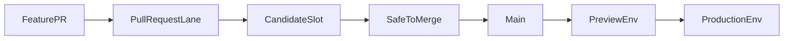

# CI/CD Pipeline Flow

## Overview

This spec defines the target CI/CD model for the repo:

- `main` is the only long-lived code branch
- pull requests prove safety before merge in fixed `candidate-*` slots
- accepted code promotes forward without rebuilds
- deployable artifacts are addressed by source SHA and image digest, never by rebuilding source in a downstream lane
- deploy branches hold environment state only and are reconciled by Argo CD

The simplification target is one artifact contract and one promotion primitive. Everything else is policy: who may request a flight, which checks gate an environment, and when humans approve.

The branch model, deploy-state model, and axioms below are the live contract — workflows, scripts, and agent skills that diverge from it are bugs, not allowed drift.

## Core Axioms

1. **`main` is code truth**. It holds safe, accepted code.
2. **Code merges when safe, not merely when ready**. Incomplete work should be hidden behind flags or stay in PRs.
3. **Pre-merge safety happens in candidate flight slots**.
4. **Build once, promote by digest**. Downstream environments never rebuild artifacts. The source repo that owns an artifact builds it and publishes `image_repository:sha-<sourceSha>`; the deploy plane resolves that tag to `image_repository@sha256:<digest>` and promotes only the digest.
5. **Deploy branches are environment state only**. `deploy/*` branches contain rendered deployment state, not product code.
6. **Argo owns reconciliation**. CI writes desired state to git; Argo syncs from git.
7. **Affected-only CI is the default**. Required checks should scope to the changed surface where practical.
8. **Release branches are exceptional only**. They are not the default path for accepted code.
9. **Direct edits to `deploy/*` are incident-only**. Repair the live environment first when necessary, then mirror the fix back into the normal source-of-truth path.
10. **Agent guidance is part of the control plane**. Prompts, skills, AGENTS files, and workflow docs must not tell agents to PR into or diff against legacy branches.
11. **Verification is a job-level gate, never a step-level skip** (bug.0321). GitHub treats a skipped step inside a running job as green. Every verification that is allowed to no-op (e.g. empty `promoted_apps`) must be gated at the _job_ level with `needs:` and `if:` so the job surfaces as **skipped (grey)** in the checks list, not as a silent-green success.
12. **Gate ordering is enforced structurally, not by convention** (bug.0321 Fix 4). When step A must precede step B in the same job, A writes a marker to `$GITHUB_ENV` (e.g. `ARGOCD_SYNC_VERIFIED=true`) and B refuses to run without it. Comments rot at the next refactor; runtime checks don't.
13. **Artifact provenance travels with the artifact** (bug.0321 Fix 4). `.promote-state/source-sha-by-app.json` on each deploy branch records the artifact source SHA that produced the deployed digest. This is true whether `source_repo` is this repo or another source repo. Production promotions copy the map forward from preview; verifiers read it to assert per-artifact contract (`/version.buildSha == map[app]`), which is the only cross-PR-safe check when affected-only CI produces a mixed-SHA overlay. (task.0345 / PR #978 moved the probe from `/readyz.version` to the dedicated unauthenticated `/version` endpoint so that infra-degraded `/readyz` 503s cannot false-fail an artifact-identity check.)
14. **Skipped verification is not success** (bug.0328; generalized per-node by task.0376). A verification job gated to no-op on an empty promotion (Axiom 11) must not let a `skipped` result read as green when work actually happened. The terminal consumers enforce this: candidate-flight's `report-status` job accepts a skipped `verify-candidate` as success **only when `has_flight_targets` is false** (no app-lever targets) — against real flight targets a non-success `verify-candidate` resolves to `failure`; preview/production's `aggregate-{preview,production}` jobs assert per-node that **every promoted matrix cell has a matching `verified-<node>.txt` marker** (`scripts/ci/aggregate-decide-outcome.sh`, Axiom 19), so a skipped-with-promotions cell hard-fails the aggregator. A promote that pushed real digests while verification never ran (e.g. `promote-build-payload.sh` aborted mid-run leaving `$GITHUB_OUTPUT` empty) is a **contradiction**. The job-level skip gate from Axiom 11 prevents _silent step-skip_ success; this axiom prevents _silent job-skip_ success at the consumer. Defense: `promote-build-payload.sh` emits its per-cell `promoted_apps` step output incrementally + via `trap EXIT` so the signal survives abort, AND the consumers above treat skip-with-work as failure.
15. **Argo "Healthy" is necessary but not sufficient** (bug.0326). `status.health.status == Healthy` fires as soon as enough pods are Ready — including pods from the **old** ReplicaSet during a rolling update. `wait-for-argocd.sh` therefore requires the promoted app's own `Deployment` resource inside the Argo `Application` to report `status=Synced`, then asserts the new ReplicaSet has reached desired count (`status.updatedReplicas >= spec.replicas` AND `status.availableReplicas >= spec.replicas`). It does **not** wait for the old ReplicaSet to fully drain — that condition is not part of the contract and routinely false-fails when an old pod terminates slowly while the new RS is already serving traffic. `verify-buildsha.sh` (run after) is the canonical "/version.buildSha == expected" proof per Axiom 19.
16. **`CATALOG_IS_SSOT`** (task.0374; supersedes the bug.0328 image-tags.sh-as-registry framing). `infra/catalog/*.yaml` is the single declaration site for nodes and node-shaped services for **CI fan-out and digest promotion**. Every consumer that needs a per-node enumeration reads catalog: `scripts/ci/lib/image-tags.sh` is a thin shim that populates `ALL_TARGETS` / `NODE_TARGETS` and resolves tag suffixes, node ports, DB names, and endpoint CSVs from catalog at source time, and node IDs from each node's `.cogni/repo-spec.yaml` (`REPO_SPEC_IS_IDENTITY_SSOT`, below); `scripts/ci/detect-affected.sh` maps changed paths to targets via catalog `path_prefix:`; ApplicationSet `files:` generators already enumerate catalog directly; per-workflow `decide` jobs read catalog via the `yq` pre-installed on `ubuntu-24.04` and emit `targets_json` + `apps_csv` outputs that downstream matrix cells consume; the **edge reverse-proxy roster** is catalog-driven too — `scripts/ci/render-caddyfile.sh` generates the Caddyfile by looping `NODE_TARGETS` (one site block per node, upstream port baked from catalog `node_port`), and `deploy-infra.sh` / `provision-env-vm.sh` write each node's per-env host (`host_for_node`) from one loop, so a new `type: node` auto-routes with no Caddyfile or deploy-script edit (task.5078). The scheduler-worker routing map is catalog-rendered as slug + `node_id` aliases by `scripts/ci/render-scheduler-worker-endpoints.sh`, and LiteLLM node-local metering callbacks are derived by `deploy-infra.sh` from the same catalog data. Catalog conformance is enforced on every PR by `check-jsonschema --schemafile infra/catalog/_schema.json infra/catalog/*.yaml` (pip-distributed CLI; no first-party GHA action), `scripts/ci/tests/render-caddyfile.test.sh` asserts the committed Caddyfile stays in sync with the catalog and `node_port` matches each per-env overlay Service nodePort (no split-brain), and `scripts/ci/render-scheduler-worker-endpoints.sh --check` asserts the committed scheduler-worker ConfigMap stays in sync with the catalog. Adding a node = drop a catalog yaml (incl. `node_port`; `node_id` lives in the node's `.cogni/repo-spec.yaml`, not the catalog) + Dockerfile + overlay; no hand-maintained route string should need editing. **Per-node overlay rendering (bug.5008).** `infra/k8s/overlays/<env>/<node>/kustomization.yaml` is catalog-rendered too: `scripts/ci/render-node-overlays.sh` (`pnpm gen:node-overlays --write`, drift-gated in the `unit` job) clones each env's `node-template` overlay and applies the per-node transforms — slug/port substitution, the `<slug>-env-secrets` ESO target, and the **node-at-root migrate rewrite** (`/app/nodes/$(NODE_NAME)/app` → `/app/app`; `NODE_AT_ROOT_MIGRATE_PATH`, because externally-built node images ship the app at `/app/app`, not the monorepo path the shared base assumes). It is the byte-exact twin of the operator's mint-time generator `gens/overlay.ts` (`nodes/operator/app/src/shared/node-app-scaffold/`); the drift gate keeps the two in lockstep, so a node minted by a **stale operator** can no longer ship a runtime-broken overlay that kustomize-builds yet crash-loops `migrate` at flight (the failure mode that was invisible to CI before the gate existed). **Still out of scope (separate follow-up):** `infra/compose/runtime/docker-compose.yml` per-service blocks remain hand-maintained until a catalog-render pass lands.

    **`REPO_SPEC_IS_IDENTITY_SSOT`** (corollary). The catalog is the SSOT for _deploy-shape_ (ports, tag suffixes, branches, `path_prefix`) — never for _identity_. A node's `node_id` is the in-repo projection of its on-chain DAO and is declared exactly once, in `nodes/<name>/.cogni/repo-spec.yaml` (ROADMAP "Repo-Spec Authority"). `image-tags.sh` resolves `node_id` from repo-spec (locating the tree via the catalog root, so the pre-merge birth flow's `COGNI_CATALOG_ROOT=app-src/infra/catalog` reads the PR's specs); the scheduler-worker map, LiteLLM metering callbacks, and `COGNI_DEFAULT_NODE_ID` (the primary-host `node_id`, replacing the formerly-hardcoded operator UUID in `cogni_callbacks.py`) all derive from it. `infra/catalog/_schema.json` _forbids_ a `node_id` key (`not: { required: [node_id] }`) and `tests/ci-invariants/catalog-identity-ssot.spec.ts` asserts every `type: node` has a repo-spec `node_id` — so the duplicate cannot return.

    **Build classes (corollary).** `image-tags.sh` also exposes an `is_infra_target` predicate. **`type: infra`** (shared VM-infra images like `litellm`) builds in CI like everything else but **deploys via Compose-on-VM, not k8s/Argo** — so it is in `ALL_TARGETS` only (never `NODE_TARGETS`), the k8s plane (overlays/promotion/Argo/gitops-coverage) skips it via `is_infra_target`, and the schema makes deploy-branches/`node_*` conditional. `type:infra` images are **content-hash tagged** (`<name>-<hash>` via `infra_image_tag`, build dir = catalog `build_context`): the affected build rebuilds them only on change, and `deploy-infra.sh` resolves the identical tag — killing the former manual `docker build` + hand-pin toil. Adding one is a one-file catalog drop (`type: infra` + `build_context`); see [create-service.md](../guides/create-service.md) §9b-infra.

    **Artifact contract (corollary).** A deployable catalog row has `source_repo` + `image_repository`. `source_repo` names the build plane; `image_repository` names the deployable artifact. The deploy plane operates on an artifact record: `{ target, source_repo, sourceSha, image_repository, digest }`. It validates a requested `sourceSha`, requires `<image_repository>:sha-<sourceSha>` to exist, resolves that tag to `image_repository@sha256:<digest>`, writes only the digest to deploy state, and records `sourceSha` in `.promote-state/source-sha-by-app.json`. This is the same contract whether the source repo is this repo or another repo. Do not create catalog types for artifact variants; if a source repo publishes multiple deployables, use artifact-shaped package names such as `<repo>-app`, `<repo>-worker`, or `<repo>-webhook`.

17. **`INFRA_K8S_MAIN_DERIVED`** (bug.0334). Every file under `infra/k8s/` on a deploy branch is byte-identical to `main` at the promoted SHA, OR is the per-overlay `env-state.yaml` (the VM-truth file written by provision). The promote workflow does a two-pass rsync: (1) `--ignore-existing` seed pass for `env-state.yaml` (bootstraps new overlays without clobbering VM-written IPs); (2) `--delete --exclude='env-state.yaml'` authoritative sync for everything else. Image digests are mutated by `promote-k8s-image.sh` after rsync — the only other deploy-branch-local write. Kustomize `replacements:` reads `env-state.yaml.data.VM_IP` and injects it into every EndpointSlice `/endpoints/0/addresses/0`, so VM IPs never live inline in `kustomization.yaml`. Violation: any non-digest, non-env-state diff between `main` and `deploy/<env>` after a promote.
18. **`LANE_ISOLATION` + `BRANCH_HEAD_IS_LEASE`** (task.0372 + task.0376). Each `(env, node)` pair has its own `deploy/<env>-<node>` branch and its own Argo Application; matrix-fanned per-node cells in `candidate-flight.yml` / `flight-preview.yml` / `promote-and-deploy.yml` write to the per-node branch only. Sibling-node failure cannot fail this cell — isolation is structural (separate GHA jobs with `fail-fast: false`), not a script-level filter. The branch ref is the lease: `concurrency: flight-${{ matrix.env }}-${{ matrix.node }}` (cancel-in-progress: false) serializes same-(env, node) writes across workflow types; cross-cell pushes go to different refs and never race. Pre-matrix `acquire-candidate-slot.sh` / `release-candidate-slot.sh` / `infra/control/candidate-lease.json` are retired. AppSets are **one object per `(env, node)`** — `infra/k8s/argocd/<env>-<node>-applicationset.yaml`, named `cogni-<env>-<node>`, rendered from the catalog by `scripts/ci/render-node-appset.sh` (drift-gated in the `unit` job; node-set = catalog rows with a `candidate_a_branch`). This makes the appset reconcile itself lane-isolated: `reconcile-appset` applies **only the flighted node's** AppSet object, so a concurrent flight whose head lacks a pre-merge node's generator can no longer re-apply a shared appset and prune that node's Application (the shared-appset clobber, `bug.0378`). **The substrate gate is per-cell, not aggregate.** In `candidate-flight.yml` the `node-substrate` and `assert-substrate` matrix cells emit a per-node `substrate-ok-<node>` / `assert-ok-<node>` artifact on cell success; the downstream `assert-substrate`, `flight`, and `verify-candidate` cells download only `matrix.node`'s marker and gate on it via `scripts/ci/resolve-substrate-gate.sh` — never on the matrix-aggregate `needs.<job>.result`, which goes `failure` whenever ANY node's cell fails and would re-couple all lanes (a dead canary's substrate failure blocking every healthy node's flight leg). A flight target not in `substrate_node_targets_json` (e.g. a `type:service`) owes no marker and passes. The retired shared `cogni-<env>` AppSet is orphan-deleted (`--cascade=orphan`, never pruning its live Applications) by the one-shot `migrate-appset-per-node.yml` cutover and defensively before every per-node apply. Each AppSet still uses `goTemplate: true` with `targetRevision: "deploy/<env>-{{.name}}"` (convention-over-config, not catalog-field indirection). Aggregator jobs (`aggregate-{preview,production}` in `promote-and-deploy.yml`) compute `current-sha = git merge-base $(deploy/<env>-<node> tips)` (`CURRENT_SHA_IS_MERGE_BASE`) and merge per-node `source-sha-by-app.json` entries into the rollup preserving unaffected entries (`ROLLUP_MAP_PRESERVES_UNAFFECTED`). `release.yml` reads the rollup `current-sha` byte-unchanged. Aggregators carry `concurrency: aggregate-${{ matrix.env }}` + rebase-retry on push (`AGGREGATOR_CONCURRENCY_GROUP`) and own preview lease state transitions (`AGGREGATOR_OWNS_LEASE`). Bootstrap: `scripts/ops/bootstrap-per-node-deploy-branches.sh` is idempotent + fast-forwarding; re-run as the last action immediately pre-merge of any AppSet / workflow flip (`BOOTSTRAP_FAST_FORWARDS_BEFORE_MERGE`). Catalog edits trigger full-matrix flights (`CATALOG_EDITS_ARE_GLOBAL_BUILD_INPUT`) so all per-node branches receive catalog changes in lockstep.
19. **`PER_NODE_DEPLOY_SELF_VALIDATES`** (task.0376; positive form of the anti-pattern shared by bug.0321 / bug.0326 / bug.0328 / bug.0336 / bug.0344 / bug.0379 and the 2026-04-26 preview+production Alchemy-cap outage). A per-node matrix cell exits `success` only when **its own** pods serve `/version.buildSha == build_sha` for that node, observed over HTTPS from outside the cluster, on the fresh ReplicaSet (per Axiom 15). No cell may exit 0 on absence: connection-refused, 502, 404, timeout, or an empty `/version` body is fail-closed with a distinct exit code, never green. A cell that promotes nothing for its node does not run verify; a cell that promotes anything MUST run verify (per Axiom 11) and MUST observe its own `/version` directly — no proxy, no upstream-signal substitution. Argo `health.status == Healthy` and `/readyz 200` are explicitly **insufficient** as success signals: the former is satisfied by old-ReplicaSet pods during a rolling update (Axiom 15), and the latter is necessarily fragile to transient external dependencies (RPC providers, billing-cap rejections, datastore blips) and must therefore degrade non-fatally rather than drain pods. Aggregator `success` is the AND of per-cell `success`; a single skipped-with-promotions cell hard-fails the aggregator (Axiom 14, applied per-node). Preview may advance when e2e is skipped only after promote, env verify, and per-node deploy verification all succeeded; production requires e2e success. `/version.buildSha` is the only signal that distinguishes "new code shipped" from "old code still running" from "no code running at all"; pipeline `exit 0` without that observation is the silent-success defect this axiom forbids. Enforced by `scripts/ci/resolve-cell-state.sh` (per-cell precondition gate), `scripts/ci/verify-buildsha.sh` (writes `verified-<node>.txt` only on contract-met success when `MARKER_DIR` is set), and `scripts/ci/aggregate-decide-outcome.sh` (asserts every promoted cell has a matching verified marker).
20. **`PRODUCTION_SCRIPTS_PINNED_TO_MAIN`** (task.0376). The `aggregate-production` job's `actions/checkout@v4` uses `ref: main` exclusively. A `workflow_dispatch` from any other ref runs the dispatched ref's workflow YAML, but the production-aggregator scripts on disk come from main — so a malicious or in-flight branch cannot inject `deploy/production` mutations by dispatching the workflow against itself. Branch protection on `main` is the actual gate; this axiom narrows the script-execution surface to that gate. Preview's aggregator deliberately uses `ref: ${{ github.sha }}` so the dispatched ref's scripts run end-to-end — pre-merge live testing on preview is intentional. The asymmetry is the contract: preview is testable from any ref, production is not.
21. **`DNS_IS_RECONCILED_PER_ENV`** (node-formation parity). Per-node public DNS is an **env-agnostic** promotion-lane concern, identical across `candidate-a`, `preview`, and `production`: every flight/promote workflow runs `reconcile-node-dns.sh <env>` (catalog-driven, idempotent A-record upsert to the env VM IP via `host_for_node`), and the per-node `/version` verify `needs:` it so a node added to the catalog resolves at its public host on its **first** promote — no hand-made record, no `*-test` wildcard. Provisioning a node's runtime dependency (DNS today; the same shape generalizes to per-node secrets + DB) happens **inside the per-env flight/promote lane, idempotently — never via a full `deploy-infra` env reprovision** (which only runs at provision time and cannot be the path that brings a single new node online). The writer (`scripts/ci/lib/cloudflare-dns.sh`) updates in place and refuses the zone apex/`www` unless `CF_ALLOW_PROTECTED=1` (only env provisioning of the apex sets it), so reconciling node DNS from CI cannot botch a healthy production record. The `CLOUDFLARE_API_TOKEN`/`CLOUDFLARE_ZONE_ID` secrets are env-scoped; an env without them logs a warning and skips (its new nodes won't resolve until the secrets are set) rather than failing the promote.
22. **`SUBSTRATE_IS_RECONCILED_BEFORE_PROMOTION`** (#1577 / #1582 / #1585; supersedes the deploy-infra-on-birth "mochi gap"). Both `candidate-flight.yml` and `promote-and-deploy.yml` run a per-node substrate-readiness lane **before** any digest promotion, so a node-ref flight self-heals its catalog-derived runtime substrate without the app lever ever running `deploy-infra.sh` (app flight promotes digests; it does not provision broad env). The lane, in `needs:` order:
    - **`prepare-substrate-deploy-branch`** bootstraps `deploy/<env>-<node>` from `deploy/<env>` so the per-node AppSet's Application can materialize before the read-only assertion runs.
    - **`materialize-substrate`** is the **sole OpenBao writer in the flight** (`scripts/ci/secret-materialize.sh`, `<env>-writer` token). It generates the node's `source: agent` secrets at `cogni/<env>/<node>/*` — including the **per-node DB credentials** (`app_<node>`/`service_<node>` passwords) and the composed Postgres DSNs (`DATABASE_URL`/`DATABASE_SERVICE_URL`; only `DOLTGRES_URL` is still deferred — #1584) — **idempotently**: read the path once, write only the missing keys in one batched `bao kv patch`, preserve existing values (`created=0` for an already-born node, no pod churn; #1585). Input is the catalog only; it never reads the VM `.env`.
    - **`reconcile-substrate`** (`scripts/ci/reconcile-node-substrate.sh`) is **read-only on OpenBao** (#1584): it mints an `<env>-db-reader` token (never `<env>-writer`), does **zero** `bao kv put/patch`, reads the per-node DB credentials `materialize-substrate` wrote, and hands them to the standard `db-provision`/`doltgres-provision` provisioners, which create the `app_<node>`/`service_<node>` roles **set-once** (never `ALTER` a pod-consumed password — bug.5002, [`secrets-management.md`](./secrets-management.md) Inv 15). It also applies the node's ESO `ExternalSecret` leaf, the edge/Caddy route, and `COGNI_NODE_DBS` membership, and emits a redacted `target_substrate_reconcile_summary` to Loki (per-row state + `error_code` + `failed_rows`).
    - **`assert-substrate`** (`scripts/ci/assert-target-substrate.sh`) is the **read-only proof gate** before promotion: VM/Argo reachable, the node `ExternalSecret` is `Ready`, the Deployment consumes `<slug>-env-secrets` (a legacy `<slug>-node-app-secrets` consumer **fails** — ESO-only contract), and the per-node DB/edge/NodePort shape exists.

    Pod secrets for node-ref flight are **ESO-only**; missing OpenBao values are loud substrate failures with no GitHub-secret fallback. **Known divergence (bug.5007):** `materialize-substrate` mints the `<env>-writer` token via the `openbao-operator` ServiceAccount, which `candidate-a` has but **production does not** — so a production promote currently fails at `materialize-substrate` until prod is provisioned with the writer SA or the job is made env-tolerant. The `<env>-writer` token boundary is canonically owned by [`secrets-management.md` Inv 15](./secrets-management.md): since **#1584**, `materialize-substrate` is the **only** holder of `<env>-writer` in the flight and `reconcile-substrate` is read-only (`<env>-db-reader`).

    **Uniform substrate across the lifecycle — selection convergence (in-flight).** The lane runs the same per-node logic everywhere, but the _selection_ of which nodes get it currently differs per workflow (candidate-flight's node-formation/node-ref gates vs promote's `has_node_targets`). That divergence let `candidate-a` and `preview` reconcile substrate differently — so a node "validated" on candidate-a did not match preview/prod behavior. The target is **identical substrate behavior at every lifecycle stage** (spawn → candidate-a flight → merge→preview → promote→prod): one shared per-node substrate **runner** (`materialize → reconcile → provision` for a single node) called by every lane with the **same** rule — _the deployable nodes this flight touches get their substrate_ — so "node-formation" stops being a special case. The runner extraction + selection convergence is the active cleanup; until it lands, treat any per-env substrate-selection difference as a bug, not a contract.

## Branch And Deploy-State Model

```text
feature/* → PR → main                               (app code)
deploy/candidate-a, deploy/candidate-b, ...        (pre-merge env state)
deploy/preview, deploy/production                  (post-merge env state)
```

- **Feature branches** are short-lived and PR into `main`.
- **`main`** is the only long-lived shared code branch.
- **`deploy/candidate-*`** branches hold desired state for pre-merge safety lanes.
- **`deploy/preview`** and **`deploy/production`** hold desired state for post-merge promotion lanes.
- CI writes deployment state directly to deploy branches; Argo watches those branches and syncs the cluster.

**Key invariant**: CI never pushes application code to protected app branches.

**Key invariant**: Promotion means changing desired state in a deploy branch, not rebuilding an image.

## Delivery Lanes



### PR Lane

The PR lane is authoritative for merge safety in v0. It is not the artifact identity model.

The deployment coordinate for a deployable artifact is `sourceSha`, paired with its catalog `image_repository`:

1. The source repo that owns the artifact runs its own PR CI.
2. That repo publishes every flightable artifact as `<image_repository>:sha-<sourceSha>`.
3. The operator API accepts `nodeRef { nodeId, sourceSha }` for hosted node flight. The parent PR number is review metadata for the operator pin/deploy-state PR, not the deploy coordinate.
4. The operator verifies source identity, repo-spec identity, parent gitlink acceptance when a gitlink is still used, and image existence.
5. `candidate-flight.yml` resolves `image_repository:sha-<sourceSha>` to an artifact record and writes `deploy/candidate-a-<target>` state.
6. Candidate validation asserts `/version.buildSha == sourceSha`.

`pr-*`, `mq-*`, and `preview-*` tags are transitional/control-plane artifact aliases for legacy in-repo build mechanics. They may exist while workflows are being migrated, but no node deploy request should use them as artifact identity.

### Main Lane

The main lane is authoritative for promotion, not for pre-merge acceptance.

1. Merge to `main` records the accepted source state and any operator pin/deploy-state changes.
2. The same proven artifact digest promotes forward without rebuild. The target model is carry-forward by artifact record; re-resolving `image_repository:sha-<sourceSha>` is acceptable only while the record store is being introduced and tags are treated immutable.
3. `preview` is the first required post-merge promotion lane in v0.
4. Production promotion happens from the same digest by policy:
   - `release.yml` (manual dispatch) cuts a `release/*` PR from the preview
     current-sha into `main`; merging it is the code-truth gate.
   - A human directly dispatches `promote-and-deploy.yml` with
     `environment=production`, `source_sha=<preview current-sha>`, and
     `build_sha=<artifact sourceSha>`. `skip_infra=true` unless
     `infra/compose/**` changed. No intermediate PR: the dispatch IS the
     human gate, same entry point as preview uses. Same workflow, same
     verify-deploy contract, same e2e — just a different env input.
   - `promote-and-deploy.yml` promotes overlay digests on
     `deploy/production` and Argo CD reconciles production pods.

Merge queue is allowed only as a source-repo merge-safety mechanism. It does not change deployment identity: the deploy plane still consumes `sourceSha` + digest.

## Minimum Authoritative Validation For V0

Do not block the rewrite on perfect black-box E2E maturity. For PRs explicitly sent to candidate flight in the current prototype, the required flight gate is:

- affected-only static checks plus unit tests
- source commit exists in `source_repo`
- `.cogni/repo-spec.yaml` at that commit matches the registered node identity for node artifacts
- `image_repository:sha-<sourceSha>` exists and resolves to a digest
- the parent operator repo accepts the gitlink pin for that source SHA while gitlinks remain the approval-pin mechanism
- **Argo CD reconciled to the deploy-branch tip SHA, the promoted Deployment resource is `Synced`, and app health is acceptable** for every app in `PROMOTED_APPS` (`scripts/ci/wait-for-argocd.sh`)
- **new ReplicaSet available** for every promoted in-cluster Deployment (`scripts/ci/wait-for-in-cluster-services.sh`); routed node-apps also wait for Service endpoint cutover so public probes cannot hit an old pod
- a prototype smoke pack passes:
  - `/readyz` returns `200` on the promoted public hosts required by the change
  - `/livez` returns structured JSON on the promoted public hosts required by the change
- **contract probe passes**: `/version.buildSha` on each promoted node-app matches the source SHA that produced its deployed digest (`scripts/ci/verify-buildsha.sh` in `SOURCE_SHA_MAP` mode, reading `.promote-state/source-sha-by-app.json` from the deploy branch)
- any human or AI validation needed to call the change safe

These gates run inside a **`verify-candidate` job** (for pre-merge candidate flight, job-level gated `if: has_flight_targets == 'true'`) or **`verify-deploy` job** (for post-merge preview + production promotion, job-level gated `if: needs.promote-k8s.result == 'success'`), both matrix-fanned per `(env, node)` and gated at the _job_ level per Axiom 11 so an empty-promotion run surfaces verification as skipped (grey), never silent-green.

Optional but non-authoritative in v0:

- auth or session sanity paths
- chat or completion probes
- scheduler or worker sanity probes
- one or two node-critical API probes
- richer black-box E2E suites
- AI probe jobs against the changed surface
- broader post-merge soak analysis

## Environment Model

### Candidate Environments

Candidate environments are fixed, pre-running slots reused across PRs. They exist to validate selected unknown code before merge without creating a new VM per PR.

| Environment | Deploy Branch        | Purpose                      |
| ----------- | -------------------- | ---------------------------- |
| candidate-a | `deploy/candidate-a` | manual pre-merge safety slot |

Start with `candidate-a` only. Add `candidate-b` later only after the one-slot prototype is proven stable.

### Promotion Environments

Promotion environments run accepted code only.

| Environment | Deploy Branch       | Purpose               |
| ----------- | ------------------- | --------------------- |
| preview     | `deploy/preview`    | post-merge validation |
| production  | `deploy/production` | production            |

### Per-Node Deploy Branches (task.0320 + task.0372)

Per-node flighting lands in two parts to keep the rollout reversible and to preserve the promotion pipeline across the transition:

**task.0320 (substrate, this PR)**: each `infra/catalog/<node>.yaml` declares three per-env branch fields (`candidate_a_branch`, `preview_branch`, `production_branch`). These fields are **dormant** — no AppSet or workflow reads them yet. Post-merge, 12 deploy branches (`deploy/<env>-<node>` for each env × node) are pushed off each env's current HEAD, also dormant. The substrate introduces no behavior change; both the catalog fields and the new branches sit unused until task.0372.

**task.0372 (cutover)**: a single atomic PR cut the flight workflows (`candidate-flight.yml`, `flight-preview.yml`, `promote-and-deploy.yml`) to `strategy.matrix` fan-out with `fail-fast: false`, each matrix cell pushing only to its per-(env, node) branch and waiting on only the matching Argo Application. That cutover kept a single shared `<env>-applicationset.yaml` per env (N per-node generators in one object).

**bug.0378 (per-node AppSet objects)**: the shared appset was the residual clobber. A flight's `reconcile-appset` re-applied the whole shared object from the flighted head_sha, so a concurrent flight whose head lacked a pre-merge node's generator pruned that node's Application. The fix splits each shared file into **one AppSet object per `(env, node)`** — `infra/k8s/argocd/<env>-<node>-applicationset.yaml`, named `cogni-<env>-<node>`, rendered from the catalog by `scripts/ci/render-node-appset.sh` (drift-gated). `reconcile-appset` now applies only the flighted node's object, so a foreign flight cannot reach another lane. The one-time live cutover is `migrate-appset-per-node.yml` (orphan-delete the shared `cogni-<env>` AppSet, then per-node AppSets adopt the orphaned Applications).

Application names stay `<env>-<node>` across the transition — the AppSet template name is unchanged. Only each Application's `targetRevision` flips from the whole-slot `deploy/<env>` to the per-node `deploy/<env>-<node>`.

The branch-per-(env, node) primitive mirrors [Kargo](https://kargo.akuity.io) Stage semantics (`Stage = per-env-per-node Application` tracking its own immutable-per-promotion ref), implemented on existing ApplicationSet + deploy-branch infrastructure without introducing new CRDs, controllers, or long-running services.

### Preview Review Lock

`deploy/preview` holds a small state directory, `.promote-state/`, that drives merge-to-main flighting. Three files:

- **`candidate-sha`** — the most recent successfully built merge-to-main SHA. High-water mark. Written unconditionally on every flight attempt (`unlocked`, `dispatching`, or `reviewing`). Policy is **latest-wins, not FIFO**: if a hotfix is queued behind a later merge, only the latest is retained.
- **`current-sha`** — the SHA actually deployed to preview and under human review. Written only after a preview deploy reaches the E2E success step. `create-release.sh` reads this to cut release branches.
- **`review-state`** — `unlocked | dispatching | reviewing`. This is a pre-dispatch lease, not a boolean.

Transitions:

| From → To                 | Written by                                          | Trigger                                                                                                                                                                                                                                                                                                                               |
| ------------------------- | --------------------------------------------------- | ------------------------------------------------------------------------------------------------------------------------------------------------------------------------------------------------------------------------------------------------------------------------------------------------------------------------------------- |
| `unlocked → dispatching`  | `scripts/ci/flight-preview.sh`                      | merge to main (or manual flight dispatch); atomic with `candidate-sha` update                                                                                                                                                                                                                                                         |
| `dispatching → reviewing` | `aggregate-preview` job in `promote-and-deploy.yml` | preview deploy reaches E2E success; writes `current-sha` (Axiom 18, `AGGREGATOR_OWNS_LEASE`)                                                                                                                                                                                                                                          |
| `dispatching → unlocked`  | `aggregate-preview` job in `promote-and-deploy.yml` | any of `promote-k8s`, `deploy-infra`, `verify`, `verify-deploy`, `e2e` does not reach success (failure, cancelled, or skipped). Empty-promotion runs legitimately skip `verify-deploy` and therefore `e2e`, so the aggregator releases the lease — preview stays unlocked instead of silently advancing against an unchanged overlay. |
| `reviewing → unlocked`    | `auto-merge-release-prs.yml`                        | release PR merges                                                                                                                                                                                                                                                                                                                     |

On release-merge unlock, if `candidate-sha != current-sha` the workflow dispatches a fresh flight with `sha=candidate-sha` to drain the queue. A flight concurrency group (`flight-preview`) serializes entry to the `unlocked → dispatching` transition; the three-value lease is the correctness guarantee even if concurrency is bypassed.

**Direct pushes to main are not a supported preview trigger.** Preview promotion needs a resolved artifact digest plus the `sourceSha` that produced it. The legacy in-repo preview workflow may re-tag `mq-{N}-{sha}` / accepted build outputs into a `preview-*` namespace while migration is in progress, but that is a lookup implementation detail, not the deployment contract. Node preview/prod promotion carries the already-resolved digest and its `sourceSha`. Maintenance commits on `main` that carry no deployable artifact change should not dispatch preview; `flight-preview.yml` skips its flight job for CI-owned maintenance prefixes such as `chore(deps): argocd-image-updater` and `chore(preview):`. Keying is **message-prefix**, not author identity (`github-actions[bot]` is shared).

## Workflow Design Targets

When implementation begins, workflow changes should follow these rules:

1. **Two lanes only**. One PR safety lane and one main promotion lane.
2. **No branch-name inference for environment routing**. Environment selection must be explicit input, artifact metadata, or deployment-state driven.
3. **No default `release/* -> main` conveyor**. If production still needs explicit approval, make it an environment or promotion control rather than a separate accepted-code branch.
4. **No duplicate orchestration**. E2E, promote, and deploy ownership should be clear rather than split across overlapping workflow graphs.

### App and infra levers are independent (task.0314)

Candidate-a deploy has two orthogonal levers; either can be dispatched independently:

| Workflow                     | Role        | Touches Argo (k8s pods) | Touches VM compose |
| ---------------------------- | ----------- | ----------------------- | ------------------ |
| `candidate-flight.yml`       | App lever   | Yes                     | No                 |
| `candidate-flight-infra.yml` | Infra lever | No                      | Yes                |

- **App lever** writes image digests to `deploy/candidate-a`; Argo CD reconciles pods. No VM SSH for compose. This upholds the `Argo owns reconciliation` axiom.
- **Infra lever** rsyncs `infra/compose/**` from a named git ref (default `main`) to the candidate-a VM and runs `compose up`. It never writes to a `deploy/*` branch.
- `scripts/ci/deploy-infra.sh` accepts `--ref <git-ref>` (default `main`) and `--dry-run`. The rsync source is a detached `git worktree add` of the ref, NOT the caller workflow's checkout — app PRs branched before an infra change can be flown without rebasing.
- **`deploy-infra.sh` is NOT a DB-credential writer.** It brings up Compose infra and provisions DB roles, but the role passwords k8s pods authenticate with are OpenBao-owned ([`secrets-management.md`](./secrets-management.md) Invariant 15, `DB_ROLE_CREDS_ARE_OPENBAO_OWNED`). Provisioning creates each role **set-once**; it MUST NOT `ALTER` a pod-consumed role password from its rendered `.env` — a second writer that diverges from the ESO-synced Secret → `28P01` → 502 (bug.5002). This is the DB facet of Axiom 21's "generalizes to per-node secrets + DB." **As-built today** it still sets the role from a GH-secret-rendered `.env` (equal to OpenBao only by construction); migrating it to read those passwords from OpenBao via an in-cluster reader JWT — so there is genuinely one source — is the phased plan in [`secrets-management.md` → DB-credential provisioning](./secrets-management.md). The per-node DB-credential cutover **landed in #1584** for the candidate-flight/reconcile path: `materialize-substrate` is the sole OpenBao writer of the per-node `app_<node>`/`service_<node>` passwords, and `reconcile-substrate` reads them via the read-only `<env>-db-reader` and provisions roles set-once (Axiom 22) — genuinely one source. `deploy-infra.sh`'s preview/prod Compose `.env` rendering is the remaining transitional copy.

**Node-formation: substrate readiness, not deploy-infra (#1577 / #1582 — Axiom 22).** A flight that _births_ a node needs its catalog-derived substrate (per-node deploy branch, OpenBao secrets, ESO `ExternalSecret` leaf, edge route, DB) to exist before pods can serve. An earlier model coupled the app lever to an in-graph `deploy-infra` job on birth (the "mochi gap"); that is **retired**. `candidate-flight.yml` now runs the read/write-bounded substrate-readiness lane of **Axiom 22** (`prepare-substrate-deploy-branch → materialize-substrate → reconcile-substrate → assert-substrate`) before `flight`, and runs **no `deploy-infra` job at all** — so the app-lever-never-provisions-broad-infra boundary holds even on birth, while the node still self-heals its own substrate. The standalone `candidate-flight-infra.yml` lever stays for infra-only and manual Compose changes.

**Substrate machinery self-validates on candidate-a (detect-affected coverage).** The substrate lane only runs for nodes `detect-affected.sh` selects, and that selector maps changed paths to image targets — so a PR that edits the **provisioning scripts themselves** (`run-node-substrate.sh`, `secret-materialize.sh`, `reconcile-node-substrate.sh`, `reconcile-secrets.sh`) is not an image-build input and previously selected **no** target, leaving the machinery unproven until a preview/prod promote. `detect-affected.sh::is_substrate_machinery_input` closes that hole: a change to those scripts selects `NODE_TARGETS`, so `node-substrate → assert-substrate` re-runs across the node set on candidate-a. It deliberately routes through the normal node-flight path (`has_flight_targets=true`) rather than a separate substrate-only signal, because the terminal `report-status` conclude treats `has_flight_targets=false` as a green no-op **before** inspecting substrate results — a substrate-only signal would silent-green a broken provisioning change. The **as-built tradeoff** is a no-op node image rebuild/reflight (the digest content is unchanged); accepted at MVP because substrate-machinery PRs are rare. `deploy-infra.sh` is **not** in the list: candidate-flight never runs it, so selecting nodes for it would cost a reflight with zero added proof — only a preview/prod promote validates that lever.

For `promote-and-deploy.yml` (preview/prod merge path), the job graph is:

```text
decide ─► reconcile-appset ──────┐
       ─► reconcile-dns           ├─► reconcile-substrate ─► promote-k8s ─► deploy-infra ─┬─► verify-deploy ─┐
       ─► materialize-substrate ──┘   (Axiom 22)                                          └─► verify        ┴─► e2e ─► aggregate-{preview,production}
```

`materialize-substrate → reconcile-substrate` (Axiom 22) run before `promote-k8s` in the merge path too, so preview/production node promotes reconcile substrate the same way candidate flight does. `aggregate-{preview,production}` replaced the former `lock-preview-on-success` / `unlock-preview-on-failure` jobs and now own the preview lease transitions (Axiom 18, `AGGREGATOR_OWNS_LEASE`): a preview run advances the lease only when promote, both verifies, and per-node deploy verification all succeeded; otherwise the aggregator releases it.

- `reconcile-dns` (Axiom 21, `DNS_IS_RECONCILED_PER_ENV`) runs from `decide` (env-level, independent of the image build), gated `if: has_targets`, env-scoped (`environment:` picks up that env's `CLOUDFLARE_*` secrets), and `verify-deploy` `needs:` it so a newly-added node's public host resolves before the `/version` probe. Mirrors `candidate-flight.yml` exactly — same `reconcile-node-dns.sh <env>`, same skip-on-missing-secret guard.
- `verify-deploy` is job-level gated `if: needs.promote-k8s.result == 'success'` (matrix-fanned per `(env, node)`; Axiom 11). Runs `wait-for-argocd` → `wait-for-in-cluster-services` → `verify-buildsha` (`SOURCE_SHA_MAP` mode). Depends on `deploy-infra` so secrets-restart completes before the contract probes run.
- `verify` and `verify-deploy` run in parallel from the `deploy-infra` fan-out; `verify` is the always-on DOMAIN probe, `verify-deploy` is the gated contract probe.
- Empty-promotion runs (infra-only, docs-only, queue-only) → `verify-deploy` skipped → `e2e` skipped → the `aggregate-{preview,production}` job releases the preview lease instead of advancing it (Axiom 11 + Axiom 14, `AGGREGATOR_OWNS_LEASE`).
- The `candidate-flight.yml` workflow runs the Axiom 22 substrate lane, then `flight → verify-candidate → report-status`. `verify-candidate` uses the same `wait-for-argocd → readiness → verify-buildsha` chain and a job-level gate of `if: has_flight_targets == 'true'`; the per-`(env, node)` branch head is the lease (Axiom 18, `BRANCH_HEAD_IS_LEASE` — the former `release-slot`/`acquire-candidate-slot` lease jobs are retired). The terminal `report-status` job enforces Axiom 14 keyed on `has_flight_targets`: a skipped/non-success `verify-candidate` is accepted as a green no-op only when `has_flight_targets` is false; against real flight targets a non-success `verify-candidate` resolves to `failure`. (The per-app `promoted_apps` signal is a step-level output of `promote-build-payload.sh` consumed by `verify-buildsha` _within_ the flight cell — it is not a `flight` job output.) `wait-for-argocd.sh` enforces Axiom 15 — once Argo reports the deploy-branch revision, acceptable app health, and a `Synced` Deployment resource for each promoted app, it asserts `status.updatedReplicas >= spec.replicas` AND `status.availableReplicas >= spec.replicas` on the Deployment (new RS has reached desired count) before `verify-buildsha` curls **`/version`** and asserts **`.buildSha`** (task.0345 / #978; not `/readyz`). It does not wait for the old ReplicaSet to drain — that is `kubectl rollout status` behavior we deliberately avoid because slow terminations false-fail healthy deploys.

### Source-SHA Map Provenance

Every deploy branch carries `.promote-state/source-sha-by-app.json` — a merge-semantics JSON map from deployed artifact name to the source SHA that produced that artifact's current overlay digest.

```json
{
  "operator": "abc123...",
  "creative": "def456...",
  "pandora": "abc123...",
  "scheduler-worker": "abc123..."
}
```

**Writers** (bug.0321 Fix 4):

- `scripts/ci/update-source-sha-map.sh` — shared primitive that merges a single `app → sha` entry into the file. Untouched apps retain their prior entry (merge, not overwrite).
- `scripts/ci/promote-build-payload.sh` — calls the primitive after each promoted app (candidate-flight path).
- `.github/workflows/promote-and-deploy.yml` promote-k8s loop — calls the primitive after each promoted app (preview + production path).
- Production promotion: a human dispatches `promote-and-deploy.yml` with `environment=production`, `source_sha=<preview current-sha>`, and `build_sha=<source SHA that produced the promoted digest>`. The target contract is digest carry-forward from preview: production should reuse the preview-proven digest and copy the source map forward. Any remaining `preview-{sha}` lookup is transitional in-repo machinery and must resolve back to the same digest/sourceSha contract before deploy-state is written.

**Reader**: `scripts/ci/verify-buildsha.sh` in `SOURCE_SHA_MAP` mode. When `NODES` is set (candidate-flight / promote-and-deploy pass `promoted_apps`), verifies only those apps' map entries — not every key in the file — so affected-only runs do not false-fail untouched apps (task.0349). When `NODES` is unset, every Ingress-probeable key in the map is checked. Each probe curls `/version` and asserts `.buildSha == map[app]`. (The probe is the dedicated `/version` endpoint, not `/readyz` — task.0345 / PR #978.)

**Why the map instead of a single `EXPECTED_BUILDSHA`**: production promotions copy preview's overlays, which can mix digests from different source repos and source SHAs. A single SHA check is only valid when every promoted artifact comes from the same source revision; the map is the only artifact-safe contract.

## Deploy Branch Rules

- Deploy branches are long-lived, machine-written environment-state refs.
- `infra/k8s/` tracks `main` under invariant `INFRA_K8S_MAIN_DERIVED` (Axiom 17). Only image digests (mutated by `promote-k8s-image.sh`) and `env-state.yaml` files (written by provision) are allowed to differ from main. All other overlay content — ConfigMap patches, Service patches, resource lists, `replacements:` blocks — is rsynced from main every promote.
- **Preview digest seed on `main` (INFRA_K8S_MAIN_DERIVED)** — `promote-and-deploy.yml` rsyncs `infra/k8s/` from **main** at the promoted SHA into `deploy/preview` before mutating digest lines. Therefore `main:infra/k8s/overlays/preview/<app>/kustomization.yaml` digest pins are the **rsync seed** for every later preview promote; they must stay pullable and aligned with GHCR.
- **task.0349 — CI-owned seed (preferred path)** — Only when Flight Preview **dispatched** `promote-and-deploy` (preview lease was `unlocked`, not queue-only), [`promote-preview-digest-seed.yml`](../../.github/workflows/promote-preview-digest-seed.yml) runs [`scripts/ci/promote-preview-seed-main.sh`](../../scripts/ci/promote-preview-seed-main.sh) (**Option B**: direct `promote-k8s-image.sh --no-commit` calls; does **not** reuse `promote-build-payload.sh`, which is coupled to deploy-branch `.promote-state/` provenance). **Tri-state per image:** resolve `preview-{mergeSha}{suffix}` when the merge produced/retagged that image; else **retain** the existing pin from the overlay if it still resolves in GHCR; else **fail**. Emits at most **one** `chore(preview): …` commit to `main` per such merge when overlay lines change. **Queue-only** Flight Preview runs (lease `reviewing` / `dispatching`) upload outcome `queued` and **do not** trigger digest seed — no bot commits for those merges. The workflow uses a read-only job plus verified checkout (`head_sha` must be an ancestor of `origin/main`) before `contents:write` push. **`preview-dispatched-marker`** in `flight-preview.yml` is skipped (grey) when the flight was queue-only, so branch protection can require it as the "preview actually dispatched" signal.
- **bug.0344 / task.0349 — Image Updater vs preview seed** — the preview per-node AppSets (`preview-<node>-applicationset.yaml`) carry **no** `argocd-image-updater.argoproj.io/*` annotations (task.0349): preview digest pins on `main` are CI-owned (`flight-preview` / `promote-and-deploy` / [`promote-preview-digest-seed.yml`](../../.github/workflows/promote-preview-digest-seed.yml)). The Image Updater controller may still be installed in-cluster from earlier bootstrap; it is no longer wired via this AppSet. **Scope guard:** [`scripts/ci/check-image-updater-scope.sh`](../../scripts/ci/check-image-updater-scope.sh) requires **zero** annotations on every `*-applicationset.yaml` (empty allowlist until a future work item re-introduces updater-backed envs). Bootstrap history: [docs/runbooks/image-updater-bootstrap.md](../runbooks/image-updater-bootstrap.md).
- **task.0373 — candidate-a self-heal (no main-seed)** — `candidate-flight.yml`'s `Sync base and catalog to deploy branch` step rsyncs `infra/k8s/overlays/candidate-a/` from the **PR branch** (not from `main`). Stale PR-branch overlay digests would therefore clobber known-good `deploy/candidate-a` digests for non-promoted apps and roll Argo to a regressing image. Fix: snapshot `deploy/candidate-a` overlay digests pre-rsync ([`scripts/ci/snapshot-overlay-digests.sh`](../../scripts/ci/snapshot-overlay-digests.sh)); after `promote-build-payload.sh` writes promoted apps' fresh digests, restore each non-promoted target's pre-rsync digest via `promote-k8s-image.sh --no-commit`. **Authority consequence:** because candidate-flight does not rsync from `main`, `main:infra/k8s/overlays/candidate-a/<app>/kustomization.yaml` digest pins have **no consumer** and are therefore **advisory and may lag** GHCR — explicitly the opposite of preview's `INFRA_K8S_MAIN_DERIVED` constraint. Cold-start (first flight against a freshly-created `deploy/candidate-a`) reads the PR-branch state into the snapshot; restore is a no-op, which is acceptable because there is no prior good state to preserve. **No new workflow, no new privileged push to main, no new maintenance message-prefix.**
- **Prettier + machine YAML** — `infra/k8s/overlays/**/kustomization.yaml` stays prettier-ignored because `promote-k8s-image.sh` and related CI writers emit YAML that does not match Prettier's style.
- They are never merged back into app branches.
- PRs are not required for routine automated deploy-state updates; git history is the audit trail.
- Push access on `deploy/*` should be restricted to the CI app or bot, with incident-only human bypass if needed.
- Rollback is by reverting deployment-state commits.

## Known Unknowns

Track these explicitly during the spec rewrite, following the CI/CD scorecard style of keeping unresolved questions visible:

- [ ] **Legacy in-repo catalog rows**
      `operator`, `resy`, `canary`, and any remaining in-repo deployables must either gain `source_repo` + `image_repository` rows that publish `sha-<sourceSha>` artifacts from this repo, or be moved out of `type: node` if they are truly control-plane-only. Until then the schema cannot honestly require `source_repo` + `image_repository` for every `type: node` row without breaking current catalog validation.
- [ ] **Candidate selection and slot control**
      Define the manual flight trigger, lease, timeout, cleanup, and status ownership without building a queueing system into v0.
- [ ] **E2E validation workflows**
      Decide what stays in the authoritative v0 gate versus what remains advisory, and define how smoke tests, richer black-box E2E, and post-merge validation divide across the PR lane and main lane.
- [ ] **Git-manager agent as a first-class control-plane actor**
      Define whether a git-manager style agent owns PR build tracking, candidate slot coordination, deploy-branch promotion, and status reporting, or whether those responsibilities stay in plain workflows with agent assistance around them.
- [ ] **Production seed freshness**
      Preview overlay seeds on `main` are CI-owned (task.0349); candidate-flight self-heals `deploy/candidate-a` around the PR-branch rsync (task.0373) so `main:infra/k8s/overlays/candidate-a/**` digests are advisory only — no main-seed needed for candidate-a; production overlays on `main` stay human-gated via direct `promote-and-deploy.yml` dispatch (env=production). Still open: a detection signal for production seed staleness (Loki/Grafana query on overlay-digest age), and whether production should follow the candidate-a self-heal pattern or the preview main-seed pattern when its rsync source is decided.
- [ ] **Rollout-status health check to replace task.0341 polling (bug.0345)**
      Argo reporting Healthy before the old ReplicaSet drains is a health-check-semantics bug, not a polling-interval bug. Bumping the poll window doesn't fix it. Fix: `kubectl rollout status deployment/X --timeout=5m` (observes `observedGeneration`, `updatedReplicas == replicas`, `Progressing=NewReplicaSetAvailable`) OR a proper Argo Deployment health check with correctly-wired probes. task.0341 solved at the wrong layer; replacement is bug.0345.
- [ ] **OpenFeature flags**
      Decide how feature flags reduce PR scope, shrink risky surface area, and let code merge when safe without requiring every incomplete capability to be fully user-exposed.
- [ ] **Merge queue integration later**
      If concurrency pressure eventually justifies merge queue, add `merge_group` workflows and revisit authoritative artifact selection at that time rather than mixing both models in v0.
- [ ] **Substrate-validation parity across envs (vFuture alignment — "envs run different deploy logic")**
      Two asymmetries remain in how substrate is _proven_, both tracked here so they converge rather than calcify:
      (1) **No-op rebuild on substrate-machinery PRs.** `detect-affected.sh::is_substrate_machinery_input` reuses the node-flight path, so proving the provisioning scripts costs a content-unchanged node image rebuild/reflight. The optimization is a dedicated `substrate_affected` axis that runs `node-substrate` **without** flight — but that is gated on first hardening the `report-status` conclude (and `promote-and-deploy`'s aggregator) to evaluate substrate results when `has_flight_targets=false`, otherwise a substrate-only run silent-greens (see "Substrate machinery self-validates on candidate-a"). Do the conclude hardening first, then split the axis.
      (2) **`deploy-infra.sh` is only proven on preview/prod.** Candidate-a asserts per-node substrate but never runs the broad Compose reconcile, so a `deploy-infra.sh` regression is invisible until a promote. The alignment target is moving the VM/Compose tier into a candidate-provable lever (k8s Ingress + cert-manager + ESO + a DB-provision Job; the same "move the VM tier into k8s" direction Axiom 21/22 generalize toward), so every env validates substrate the same way and "born green on candidate-a" implies "born green in preview/prod."

## Non-Goals For V0

This spec does not require:

- fully dynamic per-PR ephemeral environments
- perfect end-to-end coverage before adopting the model
- a production release branch for every accepted change
- a decision today on every future soak or experimentation lane

## Related Documentation

- [CI/CD Platform Boundary & Freeze Policy](cicd-platform-boundary.md) — where new deployment/platform work goes and what stops growing; surface classification + request→home routing for new work (operationalizes the line-29 "divergence is a bug" contract)
- [Legacy CI/CD To Remove](legacy-cicd-to-remove.md) — artifact-identity legacy inventory with removal conditions
- [CD Pipeline E2E](cd-pipeline-e2e.md) — trunk-alignment guide mapping legacy multi-node GitOps design to the target workflow and code-task changes
- [Candidate Slot Controller](candidate-slot-controller.md) — v0 design for lease, TTL, superseding-push handling, and aggregate candidate-flight status
- [Node CI/CD Contract](node-ci-cd-contract.md) — CI/CD sovereignty invariants, file ownership
- [Application Architecture](architecture.md) — Hexagonal design and code organization
- [Deployment Architecture](../runbooks/DEPLOYMENT_ARCHITECTURE.md) — Infrastructure details
- [CI/CD Conflict Recovery](../runbooks/CICD_CONFLICT_RECOVERY.md) — historical release conflict recovery guidance
