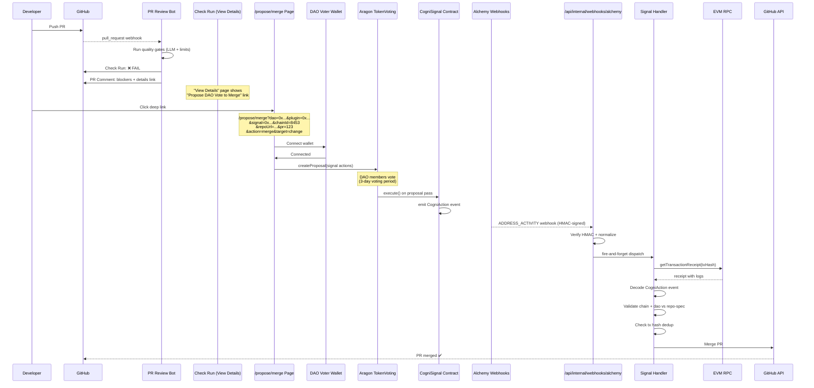

# DAO Governance Loop — PR Review to On-Chain Vote to Merge

> A PR that fails automated review can only be merged through a DAO governance vote. The full loop: review bot flags a PR → developer creates an on-chain proposal → DAO members vote → passed proposal emits a CogniAction event → cogni-template verifies on-chain and executes the GitHub action.

> [!NOTE]
> **This loop is the _governance-override_ authorization class of [Merge Authority](./merge-authority.md).** Routine merges (CI green + `deploy_verified`) and node-formation merges (capacity gate) are authorized there; this on-chain path is the escape hatch when automated gates fail. Per `SINGLE_MERGE_CHOKEPOINT`, the `mergeChange()` handler must execute through `VcsCapability.mergePr` rather than its own Octokit `pulls/merge` call.
>
> **Stale paths below:** the `File Pointers` tables predate the monorepo `nodes/` migration. Current layout is `nodes/operator/app/src/` (not `apps/operator/src/`); the three subsystems are co-located as `features/review/`, `features/governance/`, and the propose pages under `app/`. Verified governance files: `nodes/operator/app/src/features/governance/{actions,signal-handler,signal-dispatch,signal-parser,signal-types}.ts` and the receiver `nodes/operator/app/src/app/api/internal/webhooks/[source]/route.ts`.

### Key References

|             |                                                                                       |                                     |
| ----------- | ------------------------------------------------------------------------------------- | ----------------------------------- |
| **Project** | [proj.system-tenant-governance](../../work/projects/proj.system-tenant-governance.md) | Roadmap and planning                |
| **Spec**    | [Signal Execution](./governance-signal-execution.md)                                  | As-built: webhook → RPC → action    |
| **Spec**    | [DAO Enforcement](./dao-enforcement.md)                                               | Payment rails + repo-spec authority |
| **Spec**    | [Chain Configuration](./chain-config.md)                                              | Chain ID constants and validation   |
| **Spec**    | [Governance Scheduling](./governance-scheduling.md)                                   | Cron-based governance schedule sync |
| **Design**  | [Governance Integration Crawl](../design/governance-integration-crawl.md)             | Architecture rationale              |
| **Guide**   | [Alchemy Webhook Setup](../guides/alchemy-webhook-setup.md)                           | Local dev webhook configuration     |
| **Source**  | [cogni-git-review](https://github.com/Cogni-DAO/cogni-git-review)                     | Standalone review bot (ported)      |
| **Source**  | [cogni-git-admin](https://github.com/Cogni-DAO/cogni-git-admin)                       | Standalone signal executor (ported) |
| **Source**  | [cogni-proposal-launcher](https://github.com/Cogni-DAO/cogni-proposal-launcher)       | Standalone proposal UI (ported)     |

## Design

### The Complete Loop



### Three Subsystems (Formerly Three Repos)

```
┌─────────────────────────────────────────────────────────────────────┐
│                        cogni-template                               │
│                                                                     │
│  ┌──────────────────┐  ┌──────────────────┐  ┌──────────────────┐  │
│  │  PR REVIEW       │  │  PROPOSAL        │  │  SIGNAL          │  │
│  │  (git-review)    │  │  LAUNCHER        │  │  EXECUTOR        │  │
│  │                  │  │  (proposal-      │  │  (git-admin)     │  │
│  │  features/       │  │   launcher)      │  │                  │  │
│  │   review/        │  │                  │  │  features/       │  │
│  │                  │  │  app/(public)/   │  │   governance/    │  │
│  │  Webhook:        │  │   propose/merge  │  │                  │  │
│  │   GitHub PR      │  │                  │  │  Webhook:        │  │
│  │                  │  │  Client-side:    │  │   Alchemy        │  │
│  │  Output:         │  │   Wallet → tx    │  │                  │  │
│  │   Check Run      │  │                  │  │  Output:         │  │
│  │   PR Comment     │  │  Output:         │  │   GitHub API     │  │
│  │   Deep Link ─────┼──┼─▶ Aragon tx     │  │   action         │  │
│  │                  │  │                  │  │                  │  │
│  └──────────────────┘  └──────────────────┘  └──────────────────┘  │
│                                                                     │
│  ┌──────────────────────────────────────────────────────────────┐   │
│  │  SHARED INFRASTRUCTURE                                       │   │
│  │  .cogni/repo-spec.yaml — DAO contracts, chain, gates        │   │
│  │  @cogni/repo-spec      — Zod schemas, extractDaoConfig()    │   │
│  │  shared/web3/chain.ts  — Chain constants                     │   │
│  │  GitHub App creds      — GH_REVIEW_APP_ID + private key     │   │
│  │  wagmi + RainbowKit    — Wallet connection (root providers)  │   │
│  └──────────────────────────────────────────────────────────────┘   │
└─────────────────────────────────────────────────────────────────────┘
```

### On-Chain Contract Interface

```
┌─────────────────────────────────┐      ┌──────────────────────────────┐
│  CogniSignal Contract           │      │  Aragon TokenVoting Plugin   │
│                                 │      │                              │
│  signal(                        │◀─────│  createProposal(             │
│    vcs: string,        "github" │      │    _metadata: bytes,         │
│    repoUrl: string,    "gh.com" │      │    _actions: Action[],       │
│    action: string,     "merge"  │      │    _allowFailureMap: uint256,│
│    target: string,     "change" │      │    _startDate: uint64,       │
│    resource: string,   "123"    │      │    _endDate: uint64,         │
│    extra: bytes        (nonce,  │      │    _voteOption: uint8,       │
│                        deadline,│      │    _tryEarlyExecution: bool   │
│                        params)  │      │  )                           │
│  )                              │      │                              │
│                                 │      │  Action = {                  │
│  event CogniAction(             │      │    to: address,  (signal)    │
│    dao: address,                │      │    value: uint256, (0)       │
│    chainId: uint256,            │      │    data: bytes   (calldata)  │
│    vcs, repoUrl, action,        │      │  }                          │
│    target, resource, extra,     │      └──────────────────────────────┘
│    executor: address            │
│  )                              │
└─────────────────────────────────┘
```

### Configuration Authority

```
.cogni/repo-spec.yaml          ← DAO-governed, committed to git
├── cogni_dao:
│   ├── dao_contract:    0x...  ← Aragon DAO address
│   ├── plugin_contract: 0x...  ← TokenVoting plugin address
│   ├── signal_contract: 0x...  ← CogniSignal address
│   ├── chain_id:        "8453" ← Target chain (Base)
│   └── base_url:        "https://app.example.com"
├── gates:                      ← PR review gate definitions
│   ├── - type: review-limits
│   │     with: { max_changed_files: 50 }
│   └── - type: ai-rule
│         with: { rule_file: .cogni/rules/coherence.yaml }
└── payments_in:                ← Payment rails (see dao-enforcement spec)
    └── credits_topup: ...
```

All contract addresses, chain ID, and base URL are read from repo-spec at runtime via `extractDaoConfig()`. Env vars are used only for secrets (`ALCHEMY_WEBHOOK_SECRET`, `GH_REVIEW_APP_PRIVATE_KEY_BASE64`).

## Goal

Consolidate the three standalone governance services (cogni-git-review, cogni-git-admin, cogni-proposal-launcher) into cogni-template as a single deployment, providing a complete DAO governance loop: automated PR review → on-chain proposal creation → vote execution → GitHub action — all controlled by `.cogni/repo-spec.yaml`.

## Non-Goals

- Multi-DAO support (one DAO per node deployment)
- Non-EVM blockchain support
- Automated proposal creation (humans decide when to propose; the system provides the deep link)
- On-chain reconciliation of action results (actions are fire-and-forget; no receipt written back to chain)
- GitLab/Radicle action handlers (signal parser supports URL parsing, but action execution is GitHub-only)

## Invariants

### Subsystem 1: PR Review (from cogni-git-review)

| Rule                      | Constraint                                                                                                                                                     |
| ------------------------- | -------------------------------------------------------------------------------------------------------------------------------------------------------------- |
| GATES_FROM_REPO_SPEC      | Review gates are declared in `.cogni/repo-spec.yaml` `gates[]` array. No hardcoded gate list                                                                   |
| GATE_ORDER_PRESERVED      | Gates execute in declared order. Short-circuit gates (review-limits) run before LLM gates (ai-rule)                                                            |
| FAIL_PRODUCES_DEEP_LINK   | When overall verdict is `fail` and `extractDaoConfig()` returns non-null, Check Run summary includes a "Propose DAO Vote to Merge" link with full query params |
| DEEP_LINK_PARAMS_COMPLETE | Deep link URL includes all 8 params: `dao`, `plugin`, `signal`, `chainId`, `repoUrl`, `pr`, `action`, `target`                                                 |
| SYSTEM_TENANT_BILLING     | Review LLM calls are billed to `cogni_system` billing account, not the PR author                                                                               |
| CHECK_RUN_IDEMPOTENT      | Same PR + same head SHA produces at most one check run (stale comments are not re-posted)                                                                      |

### Subsystem 2: Proposal Creation (from cogni-proposal-launcher)

| Rule                    | Constraint                                                                                                                      |
| ----------------------- | ------------------------------------------------------------------------------------------------------------------------------- |
| PARAMS_FROM_URL_ONLY    | `/propose/merge` reads all contract addresses from URL search params. No server-side config dependency for the client component |
| EVM_ADDRESS_VALIDATION  | `dao`, `plugin`, `signal` params validated against `/^0x[0-9a-fA-F]{40}$/` before any contract call                             |
| REPO_URL_XSS_PREVENTION | `repoUrl` param validated against `https://github.com/<owner>/<repo>` allowlist regex                                           |
| CHAIN_SWITCH_REQUIRED   | If wallet is on wrong chain, proposal button is disabled. User must switch to target chain first                                |
| PROPOSAL_ENCODES_SIGNAL | Proposal action encodes `CogniSignal.signal(vcs, repoUrl, action, target, resource, extra)` as calldata                         |
| NO_AUTH_REQUIRED        | `/propose/merge` is a public page. Only wallet connection (for tx signing) is needed — no app login                             |
| GAS_ESTIMATION_BOUNDED  | Gas estimate includes 30% safety buffer, hard-capped at 900k                                                                    |

### Subsystem 3: Signal Execution (from cogni-git-admin)

| Rule                      | Constraint                                                                                                                                     |
| ------------------------- | ---------------------------------------------------------------------------------------------------------------------------------------------- |
| ON_CHAIN_RE_VERIFY        | Signal handler fetches tx receipt from EVM RPC and decodes CogniAction event independently. Never trusts webhook payload for action parameters |
| TX_HASH_DEDUP             | Each tx hash is executed at most once. Duplicate webhooks for the same tx are no-ops                                                           |
| WEBHOOK_VERIFY_BEFORE_USE | Alchemy HMAC-SHA256 signature verified via `timingSafeEqual` before any payload processing                                                     |
| CHAIN_DAO_MATCH           | Decoded signal's `chainId` and `dao` address must match repo-spec's declared values                                                            |
| DEADLINE_ENFORCED         | Non-zero `deadline` in signal `extra` field: reject if current time exceeds deadline                                                           |
| FIRE_AND_FORGET_DISPATCH  | Signal execution is async after webhook response. Errors logged, never block the webhook                                                       |
| DETERMINISTIC_EVENT_IDS   | Alchemy normalizer produces deterministic event IDs from tx hash. Replay = same IDs                                                            |

### Cross-Cutting

| Rule                 | Constraint                                                                                                                                                             |
| -------------------- | ---------------------------------------------------------------------------------------------------------------------------------------------------------------------- |
| DAO_CONFIG_FROM_SPEC | All contract addresses and chain ID from `.cogni/repo-spec.yaml`. Only secrets use env vars                                                                            |
| EVM_ADDRESS_SCHEMA   | `dao_contract`, `plugin_contract`, `signal_contract` validated by Zod regex at repo-spec parse time                                                                    |
| SINGLE_GITHUB_APP    | Review bot and signal executor share the same GitHub App credentials. App requires `checks: write`, `pull_requests: write`, `contents: write`, `administration: write` |
| SINGLE_DEPLOYMENT    | All three subsystems run in one Next.js process. No inter-service HTTP calls                                                                                           |

### CogniSignal Contract ABI

```
event CogniAction(
    address indexed dao,
    uint256 indexed chainId,
    string vcs,
    string repoUrl,
    string action,
    string target,
    string resource,
    bytes extra,
    address executor
)

function signal(
    string vcs,
    string repoUrl,
    string action,
    string target,
    string resource,
    bytes extra
) external
```

The `extra` field is ABI-encoded: `(uint256 nonce, uint256 deadline, string paramsJson)`.

### Signal Schema

| Field      | Type   | Description                                               |
| ---------- | ------ | --------------------------------------------------------- |
| dao        | string | DAO contract address (lowercased, from event)             |
| chainId    | number | Chain ID (from event)                                     |
| vcs        | enum   | `"github"` / `"gitlab"` / `"radicle"`                     |
| repoUrl    | string | Full repository URL                                       |
| action     | enum   | `"merge"` / `"grant"` / `"revoke"`                        |
| target     | enum   | `"change"` / `"collaborator"`                             |
| resource   | string | PR number or username                                     |
| nonce      | number | Replay nonce (from `extra`)                               |
| deadline   | number | Unix timestamp expiry; 0 = no deadline (from `extra`)     |
| paramsJson | string | Optional JSON: `mergeMethod`, `permission` (from `extra`) |
| executor   | string | Address that executed the proposal                        |

### Supported Actions

| Action Key            | Handler                | GitHub Permission       | paramsJson                                     |
| --------------------- | ---------------------- | ----------------------- | ---------------------------------------------- |
| `merge:change`        | `mergeChange()`        | `contents: write`       | `{"mergeMethod": "squash"\|"merge"\|"rebase"}` |
| `grant:collaborator`  | `grantCollaborator()`  | `administration: write` | `{"permission": "admin"\|"maintain"\|"push"}`  |
| `revoke:collaborator` | `revokeCollaborator()` | `administration: write` | _(none)_                                       |

### Deep Link URL Format

```
{base_url}/propose/merge
  ?dao=0x{40hex}
  &plugin=0x{40hex}
  &signal=0x{40hex}
  &chainId={integer}
  &repoUrl=https%3A%2F%2Fgithub.com%2F{owner}%2F{repo}
  &pr={integer}
  &action=merge
  &target=change
```

### File Pointers

**PR Review (Subsystem 1):**

| File                                                           | Purpose                                                          |
| -------------------------------------------------------------- | ---------------------------------------------------------------- |
| `apps/operator/src/features/review/services/review-handler.ts` | Orchestrator: evidence → gates → check run → comment + deep link |
| `apps/operator/src/features/review/gate-orchestrator.ts`       | Run gates in order, aggregate results                            |
| `apps/operator/src/features/review/summary-formatter.ts`       | Markdown for check run + PR comment                              |
| `apps/operator/src/features/review/gates/ai-rule.ts`           | LLM-based rule evaluation gate                                   |
| `apps/operator/src/features/review/gates/review-limits.ts`     | Numeric limits gate (file count, diff size)                      |

**Proposal Launcher (Subsystem 2):**

| File                                                                     | Purpose                                    |
| ------------------------------------------------------------------------ | ------------------------------------------ |
| `apps/operator/src/app/(public)/propose/merge/page.tsx`                  | Server component wrapper                   |
| `apps/operator/src/app/(public)/propose/merge/merge-proposal.client.tsx` | Client: wallet connect → createProposal tx |
| `apps/operator/src/features/governance/lib/proposal-utils.ts`            | Deeplink validation, gas estimation        |
| `apps/operator/src/features/governance/lib/proposal-abis.ts`             | CogniSignal + TokenVoting contract ABIs    |

**Signal Executor (Subsystem 3):**

| File                                                                | Purpose                                         |
| ------------------------------------------------------------------- | ----------------------------------------------- |
| `apps/operator/src/adapters/server/ingestion/alchemy-webhook.ts`    | HMAC verify + normalize to ActivityEvent[]      |
| `apps/operator/src/features/governance/signal-types.ts`             | Zod schemas: Signal, ActionResult, RepoRef      |
| `apps/operator/src/features/governance/signal-parser.ts`            | Decode CogniAction from tx receipt logs         |
| `apps/operator/src/features/governance/actions.ts`                  | GitHub action handlers (merge, grant, revoke)   |
| `apps/operator/src/features/governance/services/signal-handler.ts`  | Orchestrator: RPC → decode → validate → execute |
| `apps/operator/src/features/governance/services/signal-dispatch.ts` | Fire-and-forget entry from webhook route        |

**Shared Infrastructure:**

| File                                                            | Purpose                                      |
| --------------------------------------------------------------- | -------------------------------------------- |
| `.cogni/repo-spec.yaml`                                         | DAO contracts, chain, gates, payment rails   |
| `packages/repo-spec/src/schema.ts`                              | Zod schema with EVM address validation       |
| `packages/repo-spec/src/accessors.ts`                           | `extractDaoConfig()`, `extractGatesConfig()` |
| `apps/operator/src/shared/config/repoSpec.server.ts`            | Cached repo-spec loader + getDaoConfig()     |
| `apps/operator/src/app/api/internal/webhooks/[source]/route.ts` | Webhook receiver (GitHub + Alchemy)          |

### Infrastructure Requirements

| Component          | What                                                                        | How Configured                                                   |
| ------------------ | --------------------------------------------------------------------------- | ---------------------------------------------------------------- |
| GitHub App         | Receives PR webhooks, creates check runs, merges PRs, manages collaborators | `GH_REVIEW_APP_ID` + `GH_REVIEW_APP_PRIVATE_KEY_BASE64` env vars |
| Alchemy Webhook    | Monitors CogniSignal contract for ADDRESS_ACTIVITY events                   | Alchemy dashboard → `ALCHEMY_WEBHOOK_SECRET` env var             |
| EVM RPC            | Fetches tx receipts for on-chain re-verification                            | `EVM_RPC_URL` env var (Base mainnet or Sepolia)                  |
| Aragon DAO         | TokenVoting plugin + CogniSignal contract                                   | Deployed on-chain; addresses in repo-spec                        |
| wagmi + RainbowKit | Wallet connection for proposal creation                                     | Root layout providers (already wired)                            |

## Acceptance Checks

**Automated (unit tests — pass today):**

```bash
pnpm test apps/operator/tests/unit/features/governance/
pnpm test apps/operator/tests/unit/adapters/ingestion/alchemy-webhook.test.ts
pnpm test apps/operator/tests/unit/features/review/summary-formatter.test.ts
```

**E2E validation (requires running infrastructure):**

1. **Review → Deep Link**: Push a PR that fails gates → verify Check Run "View Details" contains "Propose DAO Vote to Merge" link with correct query params
2. **Proposal Page**: Navigate to `/propose/merge?...` with valid params → verify page renders, wallet connects, chain switch works
3. **Webhook → Action**: POST crafted Alchemy webhook with valid HMAC → verify signal handler fetches from RPC, decodes CogniAction, validates against repo-spec
4. **Full Loop** (deploy smoke): Create PR → review fails → create proposal → DAO votes → Alchemy webhook fires → PR merges

## Open Questions

- [ ] DB-backed tx hash dedup — in-memory Set loses state on restart; what table schema?
- [ ] Nonce replay protection — should the handler track nonces per (dao, chainId) to reject replayed signals with old nonces?
- [ ] GitHub App permission scoping — should review and signal execution use separate apps with minimal permissions each?
- [ ] `/join` and `/propose-faucet` pages — port from cogni-proposal-launcher or defer?
- [ ] Proposal metadata — IPFS upload (Pinata) for on-chain proposal descriptions, or keep `"0x"` empty metadata?
- [ ] Action result feedback — should successful actions post a PR comment confirming the merge was governance-authorized?

## Related

- [Governance Signal Execution](./governance-signal-execution.md) — As-built spec for subsystem 3
- [DAO Enforcement](./dao-enforcement.md) — Payment rails and repo-spec authority
- [Chain Configuration](./chain-config.md) — Chain ID constants and validation
- [Governance Scheduling](./governance-scheduling.md) — Cron-based governance schedule sync
- [Architecture](./architecture.md) — Hexagonal layering (adapters → ports → features)
