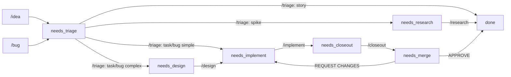

# Development Lifecycle

> Every work item status maps to exactly one `/command`. Every contributor — agent or human — runs the same loop. Sources of truth: Dolt for status/design, operator Postgres for sessions, GitHub for code/CI/comments.

## Goal

A registered agent (or human contributor) can claim a Dolt work item, push code, request a candidate-a flight, and post a `/validate-candidate` scorecard — closing the loop to `deploy_verified: true` — while the operator coordinates intent, deadlines, and notifications, and GitHub Actions + Merge Queue own deploy serialization.

## Non-Goals

- Replacing GitHub for code review, CI, or merge serialization — Dolt holds intent + design, GitHub stays the source of truth for code state.
- Synchronous human approvals inside the agent loop — gates are status transitions in Dolt, not chat handoffs.
- Real-time push from operator → contributor in v0 — the broadcaster channel (idempotent PR comments) is filed in Open Questions, not in scope here.

## Design

The full design is the rest of this spec — Interaction Graph (component map), Roles + Surfaces, Status Machine, The Loop (as-built agent flow), Validation Contract, Auth Model, Contracts, and Invariants. Read top-to-bottom for first contact; jump to the section you need on subsequent reads.

## Interaction Graph

```
              ┌──────── DOLT ────────┐    SoT for design + status
              │  work_items, designs │
              │  (revision history)  │
              └──────────────────────┘
                  ▲              ▲
        PATCH    ║  /implement   ║   /review-implementation
        status   ║               ║   (vNext: HUMAN required at gates)
                  ║              ║
┌──────────────────────────────────────────────┐
│            CONTRIBUTOR (agent or human)      │
│  /idea → /triage → /design → /implement →    │
│  /closeout → /validate-candidate             │
└──────────────────────────────────────────────┘
   │   ▲           │   ▲                │   ▲
   │   │ nextAction│   │ comment         │   │ comment
   │   │ (poll)    │   │ (push, vNext)   │   │ (scorecard)
   ▼   │           ▼   │                ▼   │
┌──────────────────────────────────────────────┐
│         OPERATOR (Postgres)                  │
│  sessions: claim, heartbeat, pr_number       │
│  policy: nextActionForWorkItem(...)          │
│  vNext: PR-comment broadcaster               │
└──────────────────────────────────────────────┘
                       │
                       │ gh comment / gh pr view
                       ▼
              ┌── GITHUB PR + CI ────┐
              │  branch, head SHA    │
              │  required checks     │
              │  PR comments (nudge) │
              └──────────────────────┘
                       ▲
                       │  visual review (vNext: HUMAN)
                       │  /promote prod (HUMAN today)
                  ┌────────┐
                  │ HUMAN  │  required at: design approval (vNext),
                  │        │  validate-candidate visual eyes,
                  └────────┘  prod promote, security
```

## Roles + Surfaces

PR comments are **notifications**, never state of record. Design decisions live in Dolt `designs`. Status lives in Dolt `work_items`. Deploy state lives in `/version.buildSha`. Coordination state lives in operator Postgres.

| Surface                                | Carries                                          | Mutated by                                                                            |
| -------------------------------------- | ------------------------------------------------ | ------------------------------------------------------------------------------------- |
| Dolt `work_items`, `designs`           | status, design, outcome, validation block        | `/idea`, `/triage`, `/design`, `/implement`, `/closeout`, `/review-implementation`    |
| Operator Postgres `work_item_sessions` | claim, heartbeat, deadline, branch, pr_number    | `POST /claims`, `/heartbeat`, `/pr`                                                   |
| GitHub PR + CI                         | code, head SHA, required checks, merge state     | `git push`, `gh pr create`, GitHub Merge Queue                                        |
| GitHub PR comments                     | scorecards, operator nudges (vNext: broadcaster) | `/validate-candidate`, `cogni-git-review`, agent (rare), operator broadcaster (vNext) |

If something proposes a design change in a PR comment, that's a bug — capture it in Dolt via `/design` first.

## Status Machine

9 status values. Every `needs_*` status has exactly one command that resolves it.



| Status            | Command                  | What happens                                                        |
| ----------------- | ------------------------ | ------------------------------------------------------------------- |
| `needs_triage`    | `/triage`                | Routes item; stories → `done`; tasks/bugs → next status             |
| `needs_research`  | `/research`              | Executes spike; spike → `done`; creates follow-up items             |
| `needs_design`    | `/design`                | Writes/updates spec; task/bug → `needs_implement`                   |
| `needs_implement` | `/implement`             | Writes code on branch                                               |
| `needs_closeout`  | `/closeout`              | Docs/headers pass + creates PR                                      |
| `needs_merge`     | `/review-implementation` | Reviews PR; APPROVE → `done` or REQUEST CHANGES → `needs_implement` |

Terminal: `done` (PR merged; `deploy_verified` tracked separately), `blocked` (`blocked_by:` required), `cancelled`.

### Triage routing

- `/triage` on **story** → story `done` (intake complete); may create task/bug items.
- `/triage` on **bug/task** routes to `needs_design` when ANY of: touches >1 module/package boundary; introduces a new port/schema column/HTTP contract; root cause unclear; >1 reasonable implementation exists. Otherwise → `needs_implement` directly.
- `/triage` on **spike** → `needs_research`.

### Loop limit

`revision: 0` field on the work item. Incremented each time `/review-implementation` sends an item back to `needs_implement`. `revision >= 5` → auto-set `blocked` with note "Review loop limit — escalate to human."

### Spec state lifecycle

| State        | Meaning                          | Required                                              |
| ------------ | -------------------------------- | ----------------------------------------------------- |
| `draft`      | Exploratory. May not match code. | Invariants can be incomplete. Open Questions allowed. |
| `proposed`   | Stable enough to review against. | Invariants enumerated. Acceptance checks defined.     |
| `active`     | Matches code. Enforced.          | Open Questions empty. `verified:` current.            |
| `deprecated` | No longer authoritative.         | Points to replacement spec.                           |

## The Loop — As Built (Agent Contribution)

External AI agent: discover → register → claim → push → flight → self-validate. No human required for routine merges.

### 1. Discover

```bash
BASE=https://test.cognidao.org
curl $BASE/.well-known/agent.json | jq .endpoints
```

The well-known doc is the only hard-coded URL. Everything else is discovered from it.

### 2. Register

```bash
API_KEY=$(curl -s -X POST $BASE/api/v1/agent/register \
  -H "Content-Type: application/json" \
  -d '{"name":"my-agent"}' | jq -r .apiKey)
```

Bearer token. Same `SessionUser.id` shape as a SIWE-authed human.

### 3. Adopt + claim a work item

Adopt **exactly one** work item (1 work item ≈ 1 PR). Prefer adopting an existing `needs_implement`/`needs_design` item over creating a new one.

```bash
# claim — once
curl -s -X POST $BASE/api/v1/work/items/$ID/claims \
  -H "Authorization: Bearer $API_KEY" -H "content-type: application/json" \
  -d '{"lastCommand":"/implement"}'

# heartbeat — every 5–10 min while active; deadline is 30 min
curl -s -X POST $BASE/api/v1/work/items/$ID/heartbeat \
  -H "Authorization: Bearer $API_KEY" -H "content-type: application/json" \
  -d '{"lastCommand":"/implement"}'

# poll coordination — operator's pushback channel; obey nextAction
curl -s $BASE/api/v1/work/items/$ID/coordination \
  -H "Authorization: Bearer $API_KEY" | jq .nextAction
```

The operator does **not** accept patches/diffs. Agents push their own branches via standard git.

### 4. Push branch + open PR + link

```bash
git push origin feat/my-change
gh pr create --title "feat: my change" --body "Opened by my-agent." --base main
PR_NUMBER=<number from gh output>

curl -s -X POST $BASE/api/v1/work/items/$ID/pr \
  -H "Authorization: Bearer $API_KEY" -H "content-type: application/json" \
  -d "{\"branch\":\"feat/my-change\",\"prNumber\":$PR_NUMBER}"
```

`POST /pr` links the PR to both the operator session **and** the durable Dolt work item. The agent does not run `gh pr ready` here — PRs are not "ready for review" until step 7.

### 5. Wait for CI green

Watch required checks (`unit`, `component`, `static`, `manifest`) on the PR head SHA. Until they're green, the flight endpoint will reject with 422.

### 6. Request candidate-a flight

Every artifact — the in-repo operator app and externally built node artifacts alike — flights through
the **same operator-API call, addressed by `nodeRef` (never a PR number, never personal `gh`)**:

```bash
curl -s -X POST $BASE/api/v1/vcs/flight \
  -H "Authorization: Bearer $API_KEY" -H "content-type: application/json" \
  -d '{"nodeRef":{"nodeId":"<node_id>","sourceSha":"<head_sha>"}}'
```

For the operator's own monorepo PR, `nodeId` is the operator node — it is the one IN-REPO node, so it
resolves to the monorepo as its own repo; `sourceSha` is the PR head SHA.

The API response includes workflow dispatch metadata. The endpoint is a thin
gate: it authenticates the caller, checks node flight authorization when RBAC is
configured, verifies nodeRef source/image preflight, and dispatches
`candidate-flight.yml`. The candidate slot lease is owned by the workflow itself
— the per-`(env, node)` branch head **is** the lease ([ci-cd.md](./ci-cd.md)
Axiom 18, `BRANCH_HEAD_IS_LEASE`) — so the endpoint does not replicate it.

### 7. Self-validate

After successful flight, hit your feature endpoint on `test.cognidao.org` (the candidate-a URL for operator) and confirm behavior. Run `/validate-candidate` — it owns the impact-matrix-and-Loki-marker scorecard. Post the scorecard as a PR comment.

This is the **real** validation gate (`SELF_VALIDATE` invariant). `status: done` is just the code gate; `deploy_verified: true` is the signal that the feature actually works on the deployed build.

### 8. Request merge — the operator is the merge authority

The contributor does **not** self-merge. Reaching `deploy_verified: true` (the posted `/validate-candidate` scorecard) is the contributor's _request_; the **operator** authorizes and enqueues the merge.

> **North star:** the cogni-operator app — the AI that runs the network's gitops — is the **single, accountable merge authority** for the whole network. Every merge flows through **one** capability (`VcsCapability.mergePr`); a **deterministic policy router** decides _when_ a PR may merge based on its class. The contributing agent/human never self-merges its own work. GitHub re-enforces required checks at merge; GitHub Merge Queue (when enabled) still owns rebase/retest/serialization.

> **As-built today.** The operator-merge path is **live**: once CI is green and the `/validate-candidate` scorecard is posted, request the merge via `POST /api/v1/vcs/merge { nodeId, prNumber }` — the operator GitHub App enqueues the squash merge (returns `{enqueued:true}`; poll the PR to `MERGED`). Every node, the operator included, is addressed by `nodeId`. You never self-merge with personal `gh`.

### Authorization classes (deterministic policy router, operator-owned)

The merge decision is **policy** (gate booleans), never an LLM judgment, so the merge sequence stays auditable (`DETERMINISTIC_AUTHORIZATION`). Authorization is deterministic; execution is a vendor primitive (`PUT /pulls/{}/merge`, or the queue when enabled).

| Class                                                                    | Authority                            | Gate (all must hold)                                                                                                                | Execution                      |
| ------------------------------------------------------------------------ | ------------------------------------ | ----------------------------------------------------------------------------------------------------------------------------------- | ------------------------------ |
| **Routine** (work-item PR)                                               | operator                             | CI `allGreen` ∧ `work_item.deploy_verified == true` (`/validate-candidate` scorecard posted) ∧ authorizer ≠ claiming contributor    | direct `mergePr` (gated)       |
| **Node-formation** (operator-authored `cogni-operator/node-submodule-*`) | operator                             | `allGreen` ∧ wizard-born node count `< NODE_CAPACITY_CEILING` (else comment + hand back)                                            | direct `mergePr` (gated)       |
| **Governance override** (PR that failed automated gates)                 | DAO vote → CogniSignal `CogniAction` | on-chain re-verify (`ON_CHAIN_RE_VERIFY`, `CHAIN_DAO_MATCH`, `TX_HASH_DEDUP` — see [dao-governance-loop](./dao-governance-loop.md)) | direct merge (vote serializes) |

**Execution reality (verified 2026-06-11):** `main` has no enforced merge queue, so the operator **direct-merges** via `mergePr`; GitHub still re-enforces the 4 required status checks on the merge API, so a gate-passing `mergePr` is double-checked. `mergePr` is already queue-tolerant — it detects the base branch's queue state up front and branches: **no queue → direct `PUT .../merge`** (synchronous, `merged` + `sha`); **queue required → `enablePullRequestAutoMerge`** which routes through the queue (`enqueued: true`, async — poll the PR). The merge contract is `merged XOR enqueued`. The queue requirement is config-as-code (`infra/github/merge-queue-ruleset.json`, applied by `setup-main-branch.sh`); until an admin flips it to `active`, the enqueue path is inert and `mergePr` direct-merges everywhere.

**The node-formation capacity gate** is the MVP capacity primitive: the operator has **no** awareness of VM capacity yet, so the ceiling is the config value `NODE_CAPACITY_CEILING` (env, default 8 — never a hardcoded literal), and the count is wizard-born nodes in the deployment parent's catalog (`infra/catalog/*.yaml` entries with `type: node` + `source_repo`; the post-#1647 deployment SSOT, **not** the operator `nodes` table). `8` is the measured honest single-6GB-VM density (see [node-app-scaling-architecture](../research/2026-06-10-node-app-scaling-architecture.md)); set the ceiling from that doc's measured density, never independently. At/over ceiling the operator stops and hands back naming the next action (resize the env VM, or split per-env membership so existence stops implying a pod everywhere). Enforced at publish today (`POST /api/v1/nodes/{id}/publish` returns `409 at_capacity` before minting consumes compute); the merge step reuses the same primitive.

### Session binding

Every operator merge is auditable to a work-item session, via the `(repo_full_name, pr_number)` → active `work_item_sessions` lookup. Routine PRs already carry a session (the contributor claimed the work item); node-formation PRs get an operator-owned session at mint time. A merge with no resolvable session is rejected (or flagged `unmediated`).

### Mechanics

- The operator authorizes a routine work-item PR only when CI is `allGreen` **and** `deploy_verified: true`, and the authorizer differs from the claiming contributor (`MERGE_SEPARATION_OF_DUTIES`). The decision is deterministic policy, not LLM judgment.
- When the queue is enabled, the operator enqueues and **GitHub Merge Queue** rebases onto current `main`, re-runs required checks, and merges deterministically. No one rebases by hand (`NO_AGENTIC_REBASE`).
- Required checks must fire on **both** `pull_request:` and `merge_group:` triggers (`REPORT_OR_DON'T_REQUIRE` — see [merge-queue-config](./merge-queue-config.md)).
- A PR that fails automated gates merges only through the on-chain governance override (DAO vote → CogniSignal — see [dao-governance-loop](./dao-governance-loop.md)).

The agentic contribution loop terminates here. Post-merge, `push:main` triggers `flight-preview`, which auto-promotes the merged SHA to preview.

## Multi-Agent Roles

Distinct specialized agents own each lifecycle stage. No single agent runs the full loop.

| Agent             | Owns                                                                                                                                                                    |
| ----------------- | ----------------------------------------------------------------------------------------------------------------------------------------------------------------------- |
| `pr-manager`      | VCS orchestration + **merge authority**: listPrs, getCiStatus, flightCandidate, monitor Argo, verify SHA, authorize + enqueue merge on `deploy_verified` (see §8 above) |
| `gov-engineering` | Dispatch loop: reads work queue → invokes `/design`, `/implement`, `/closeout`, `/review-implementation`                                                                |
| `pr-review`       | Code-quality review on PR open/update (cogni-git-review GitHub App)                                                                                                     |
| `qa-agent`        | Post-flight feature validation (task.0309) — manual predecessor is `/validate-candidate`                                                                                |
| `frontend-tester` | Playwright click-through (delegated by qa-agent for UI paths)                                                                                                           |

`POST /api/v1/vcs/flight` is the **nodeRef primitive** for externally built node artifacts (deterministic dispatch — agent knows the source SHA and wants to fly now). Direct workflow dispatch remains the in-repo operator app PR lever. `pr-manager` is the **policy** layer (decides when to fly, monitors rollout, verifies SHA, requests merge). Do not add policy logic to the REST endpoint.

| Responsibility            | `POST /api/v1/vcs/flight` | `pr-manager`          |
| ------------------------- | ------------------------- | --------------------- |
| Verify CI green           | ✅                        | ✅                    |
| Dispatch candidate-flight | ✅                        | ✅                    |
| Acquire slot lease        | ❌ (workflow owns it)     | ❌ (workflow owns it) |
| Monitor Argo rollout      | ❌                        | ✅                    |
| Verify deployed SHA       | ❌                        | ✅                    |
| Exercise feature + Loki   | ❌                        | ✅ (validate step)    |
| Request merge (enqueue)   | ❌                        | ✅                    |
| Rebase + retest + merge   | ❌ (merge queue owns)     | ❌ (merge queue owns) |

## Validation Contract

Every task and bug **must** include a `## Validation` section before `/closeout` creates the PR (`VALIDATION_REQUIRED`):

```markdown
## Validation

exercise: |
POST https://test.cognidao.org/api/v1/<feature>
Authorization: Bearer <CANDIDATE_TOKEN>
body: {...}
assert: response.status == 200, body matches <shape>

observability: |
{namespace="cogni-candidate-a"} | json | msg="<feature-specific-event>"
expect: ≥1 entry within 60s of exercise

smoke_cmd: |
curl -sf https://test.cognidao.org/api/v1/health | jq '.status == "ok"'
```

`exercise:` + `observability:` are the qa-agent's test specification (`QA_READS_TASK`). `smoke_cmd:` is an optional shell fallback. Generic `/readyz` traffic is not proof (`FEATURE_LOG_PROOF`).

## Deploy Verification

`status: done` = PR merged (code gate — unchanged).

`deploy_verified: true` = qa-agent / `/validate-candidate` confirmed post-flight (set autonomously when):

1. `candidate-flight` status = success on PR head SHA
2. Health scorecard returns: restarts=0, memory < 90% of limit, oom_kills=0
3. Feature exercise from the work item's `## Validation` block passes against the deployed URL
4. Observability signal confirmed in Loki at the deployed SHA

E2E success: one work item reaches `deploy_verified=true` via fully automated pipeline.

## Auth Model

| Method       | Source                        | Scope                                      |
| ------------ | ----------------------------- | ------------------------------------------ |
| Bearer token | `POST /api/v1/agent/register` | Machine agent; read/write to own resources |
| SIWE session | Browser wallet sign-in        | Human operator; same route access          |

All contribution endpoints require auth (`AUTH_REQUIRED`). No publicly writable endpoints.

## Contracts

| Contract                                                             | Location                                                             |
| -------------------------------------------------------------------- | -------------------------------------------------------------------- |
| `POST /api/v1/vcs/flight`                                            | `packages/node-contracts/src/vcs.flight.v1.contract.ts`              |
| Agent registration                                                   | `packages/node-contracts/src/agent-register.v1.contract.ts`          |
| Work-item sessions (`/claims`, `/heartbeat`, `/pr`, `/coordination`) | `nodes/operator/app/src/contracts/work-item-sessions.v1.contract.ts` |
| Work items (CRUD + PATCH)                                            | `packages/node-contracts/src/work.items.*.v1.contract.ts`            |

## PR Body Format

```markdown
## References

Work: task.0042
Spec: docs/spec/feature.md#invariants (or Spec-Impact: none)
```

Missing `Work:` → merge blocked. Missing `Spec:` → warning (blocked if behavior/security/interface change).

## Invariants

| Rule                               | Constraint                                                                                                                                                                                                                                                                                                                 |
| ---------------------------------- | -------------------------------------------------------------------------------------------------------------------------------------------------------------------------------------------------------------------------------------------------------------------------------------------------------------------------- |
| `STATUS_COMMAND_MAP`               | Every `needs_*` status has exactly one command. No ambiguity.                                                                                                                                                                                                                                                              |
| `BRANCH_REQUIRED`                  | `branch:` must be set when status ∈ {`needs_implement`, `needs_closeout`, `needs_merge`}. `/implement` creates if missing.                                                                                                                                                                                                 |
| `PR_EVIDENCE_REQUIRED`             | `pr:` must be set before entering `needs_merge`.                                                                                                                                                                                                                                                                           |
| `BLOCKED_EVIDENCE`                 | `blocked_by:` must be set when status = `blocked`.                                                                                                                                                                                                                                                                         |
| `CLEAN_WORKTREE_ON_EXIT`           | `/implement` and `/closeout` must end with clean `git status`.                                                                                                                                                                                                                                                             |
| `COMMIT_ON_PROGRESS`               | Commands that change repo files must end with ≥1 commit. Review-only commands are exempt.                                                                                                                                                                                                                                  |
| `CLAIM_REQUIRED`                   | Governance runner sets `claimed_by_run` before acting. Prevents double-dispatch.                                                                                                                                                                                                                                           |
| `LOOP_LIMIT`                       | `revision >= 5` → `blocked` with escalation note.                                                                                                                                                                                                                                                                          |
| `STORIES_ARE_INTAKE`               | Stories go `done` after triage. Never enter implementation lifecycle.                                                                                                                                                                                                                                                      |
| `DEPLOY_VERIFIED_SEPARATE`         | `done` = merged (code gate). `deploy_verified` = qa-agent confirmed post-flight. Never conflate.                                                                                                                                                                                                                           |
| `VALIDATION_REQUIRED`              | Every task/bug must have `## Validation` with `exercise:` + `observability:` before `/closeout` creates PR.                                                                                                                                                                                                                |
| `FEATURE_SMOKE_SCOPED`             | qa-agent validation must exercise the specific feature, not just generic `/readyz`.                                                                                                                                                                                                                                        |
| `QA_READS_TASK`                    | qa-agent derives its test from the work item `## Validation` block — not from a separate test file.                                                                                                                                                                                                                        |
| `PR_LINKS_ITEM`                    | Every code PR references exactly one primary work item (`task.*` or `bug.*`) and at least one spec, or `Spec-Impact: none`.                                                                                                                                                                                                |
| `TRIAGE_OWNS_ROUTING`              | Only `/triage` sets or changes the `project:` linkage on an idea or bug.                                                                                                                                                                                                                                                   |
| `SPEC_NO_EXEC_PLAN`                | Specs never contain roadmap, phases, tasks, owners, or timelines. At any `spec_state`.                                                                                                                                                                                                                                     |
| `SPEC_STATE_LIFECYCLE`             | `draft` → `proposed` → `active` → `deprecated`. No skipping.                                                                                                                                                                                                                                                               |
| `ACTIVE_MEANS_CLEAN`               | `spec_state: active` requires Open Questions empty and `verified:` current.                                                                                                                                                                                                                                                |
| `REVIEW_BEFORE_MERGE`              | `/review-implementation` runs at `needs_merge` (reviews the PR, not pre-PR code).                                                                                                                                                                                                                                          |
| `MACHINE_READABLE_ENTRY`           | All endpoints discoverable via `/.well-known/agent.json`; no hardcoded URLs in agent code.                                                                                                                                                                                                                                 |
| `AUTH_REQUIRED`                    | No contribution endpoint is publicly writable.                                                                                                                                                                                                                                                                             |
| `CI_GATE`                          | `/api/v1/vcs/flight` verifies CI is green for the exact PR head SHA before dispatching.                                                                                                                                                                                                                                    |
| `NO_LEASE_SPLIT_BRAIN`             | Slot lease lives on the deploy branch — the per-`(env, node)` branch head is the lease ([ci-cd.md](./ci-cd.md) Axiom 18, `BRANCH_HEAD_IS_LEASE`); the flight endpoint does not write a competing lease.                                                                                                                    |
| `PRIMITIVE_OVER_POLICY`            | `/api/v1/vcs/flight` is a primitive action; pr-manager is the policy layer; do not add flight logic to the REST endpoint.                                                                                                                                                                                                  |
| `OSS_FOR_CODE_WORK`                | Agents use standard git + `gh pr create` for code contribution; the operator provides only the flight gate and the coordination port.                                                                                                                                                                                      |
| `SELF_VALIDATE`                    | Agents validate their own changes on candidate-a; `deploy_verified: true` is the real gate, not `status: done`.                                                                                                                                                                                                            |
| `FEATURE_LOG_PROOF`                | Post-flight validation must tie Loki evidence to the exercised feature route/tool/graph, not ambient pod traffic.                                                                                                                                                                                                          |
| `OPERATOR_MERGE_AUTHORITY`         | The operator authorizes + enqueues merges on `deploy_verified`; contributors never self-merge their own PR. Full policy: §8 above.                                                                                                                                                                                         |
| `SINGLE_MERGE_CHOKEPOINT`          | Every operator merge goes through `VcsCapability.mergePr`. No feature issues `PUT /pulls/{}/merge` directly — governance `mergeChange()` must converge onto the capability.                                                                                                                                                |
| `MERGE_SEPARATION_OF_DUTIES`       | The PR's requesting party is never its approver. For routine PRs, authorizer ≠ claiming contributor (`work_item_sessions.claimed_by_user_id`). For node-formation the operator both authors and merges, so SoD means the **requesting node owner is excluded** and the gate is fully deterministic (CI = injection proof). |
| `ROUTINE_REQUIRES_DEPLOY_VERIFIED` | A work-item PR merges only when CI `allGreen` AND `deploy_verified == true`. (`DEPLOY_VERIFIED_SEPARATE` still holds: `done` = merged; `deploy_verified` = validated.)                                                                                                                                                     |
| `NODE_FORMATION_CAPACITY_GATE`     | An operator-authored node-formation PR merges only when CI `allGreen` AND wizard-born node count `< NODE_CAPACITY_CEILING`; the ceiling derives from the scaling doc's measured honest density, never an independent literal. At/over ceiling: comment + hand back, do not merge.                                          |
| `GOVERNANCE_OVERRIDE_ON_CHAIN`     | A PR that failed automated gates merges only via a re-verified on-chain `CogniAction` (`merge:change`).                                                                                                                                                                                                                    |
| `DETERMINISTIC_AUTHORIZATION`      | Routine + node-formation merge decisions are deterministic policy (gate booleans), not LLM judgment. Preserves `NO_AGENTIC_REBASE`.                                                                                                                                                                                        |
| `MERGE_BOUND_TO_SESSION`           | Every operator merge resolves to an active `work_item_sessions` row by `(repo_full_name, pr_number)`. Unresolvable → reject/flag `unmediated`.                                                                                                                                                                             |
| `MERGE_QUEUE_DETERMINISM`          | Rebase + retest + merge is owned by GitHub Merge Queue (when enabled); agents only request merge.                                                                                                                                                                                                                          |
| `NO_AGENTIC_REBASE`                | No LLM in the merge path; rebase is a vendor primitive (GH Merge Queue) so the merge sequence is auditable and reproducible.                                                                                                                                                                                               |
| `COMMENTS_ARE_NOTIFICATION`        | GitHub PR comments carry scorecards + nudges. Design decisions and status mutations belong in Dolt, never in comment threads.                                                                                                                                                                                              |

## File Pointers

| File                                                                                                               | Purpose                                         |
| ------------------------------------------------------------------------------------------------------------------ | ----------------------------------------------- |
| `.claude/commands/{idea,bug,triage,research,design,task,implement,closeout,review-implementation,pull-request}.md` | Slash command definitions                       |
| `.claude/skills/contribute-to-cogni/SKILL.md`                                                                      | Executable contributor wrapper                  |
| `.claude/skills/validate-candidate/SKILL.md`                                                                       | Post-flight validation procedure                |
| `nodes/operator/app/src/features/work-item-sessions/session-policy.ts`                                             | `nextActionForWorkItem` + session deadline math |
| `nodes/operator/app/src/contracts/work-item-sessions.v1.contract.ts`                                               | Sessions API Zod contracts                      |
| `nodes/operator/app/src/app/api/v1/work/items/[id]/{claims,heartbeat,pr,coordination}/route.ts`                    | Sessions REST endpoints                         |
| `nodes/operator/app/src/app/api/v1/vcs/flight/route.ts`                                                            | Flight primitive                                |
| `nodes/operator/app/src/app/.well-known/agent.json/route.ts`                                                       | Agent discovery doc                             |
| `scripts/validate-docs-metadata.mjs`                                                                               | Frontmatter and heading validation              |
| `infra/github/`                                                                                                    | Merge queue + branch protection fixtures        |

## Open Questions

- [ ] Operator broadcaster v0 (push nudges via PR comments using `<!-- cogni-coord-v0 -->` marker). Designed in [`docs/design/operator-dev-lifecycle-coordinator.md`](../design/operator-dev-lifecycle-coordinator.md). Until built, the loop closes only when contributors poll `GET /coordination`.
- [ ] Migrate this spec into the Dolt knowledge port (task.0001). Until then, it lives in markdown.
- [ ] CI enforcement of PR body format (`Work:` / `Spec:` lines).
- [ ] Lint specs for roadmap/phase language (`SPEC_NO_EXEC_PLAN` enforcement).

## Related

- [`docs/spec/ci-cd.md`](./ci-cd.md) — environment model, deploy branches, source-sha map, candidate-flight workflow, slot lease semantics (Axiom 18, `BRANCH_HEAD_IS_LEASE`)
- [`docs/spec/merge-queue-config.md`](./merge-queue-config.md) — required checks, `REPORT_OR_DON'T_REQUIRE`
- [`docs/spec/docs-work-system.md`](./docs-work-system.md) — type taxonomy and ownership
- [`docs/design/operator-dev-lifecycle-coordinator.md`](../design/operator-dev-lifecycle-coordinator.md) — coordinator design (Phase 1 done; Phase 2/3 deferred until v0 broadcaster lands)
- [`work/README.md`](../../work/README.md) — work management front door
