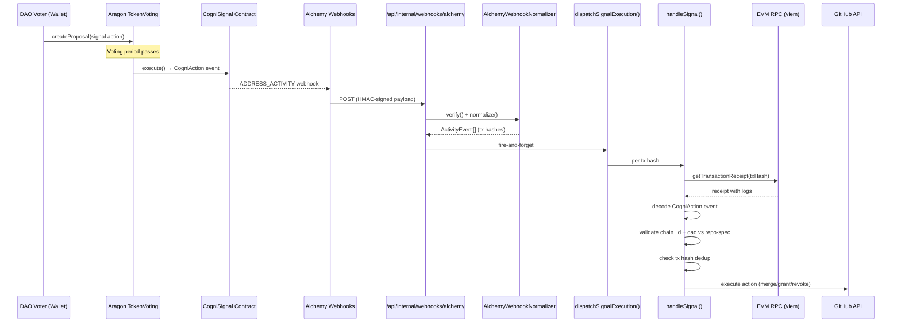
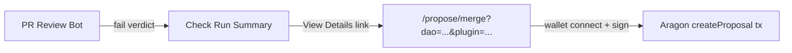

# Governance Signal Execution — On-Chain DAO Votes to GitHub Actions

> Receives Alchemy webhooks containing on-chain CogniAction events, independently verifies them via EVM RPC, and executes the corresponding GitHub action (merge PR, grant/revoke collaborator).

### Key References

|             |                                                                                       |                           |
| ----------- | ------------------------------------------------------------------------------------- | ------------------------- |
| **Project** | [proj.system-tenant-governance](../../work/projects/proj.system-tenant-governance.md) | Roadmap and planning      |
| **Design**  | [Governance Integration Crawl](../design/governance-integration-crawl.md)             | Architecture rationale    |
| **Related** | [DAO Enforcement](./dao-enforcement.md)                                               | Payment rails + repo-spec |
| **Related** | [Chain Configuration](./chain-config.md)                                              | Chain ID authority        |

## Design

### End-to-End Flow



### Proposal Deep Link Flow



When the review bot produces a `fail` verdict, the Check Run "View Details" page includes a "Propose DAO Vote to Merge" link. This link carries all contract addresses as URL params, targeting the `/propose/merge` public page.

### Component Boundaries

```
adapters/server/ingestion/
  alchemy-webhook.ts        ← WebhookNormalizer port (HMAC verify + normalize)

features/governance/
  signal-types.ts           ← Zod schemas: Signal, ActionResult, RepoRef
  signal-parser.ts          ← Pure: decode CogniAction event from tx receipt logs
  actions.ts                ← GitHub action handlers (merge, grant, revoke)
  services/
    signal-handler.ts       ← Orchestrator: RPC fetch → decode → validate → execute
    signal-dispatch.ts      ← Fire-and-forget entry point from webhook route

features/governance/lib/
  proposal-abis.ts          ← CogniSignal + TokenVoting ABIs (client-side)
  proposal-utils.ts         ← Deeplink param validation, gas estimation

app/(public)/propose/merge/
  page.tsx                  ← Server component wrapper
  merge-proposal.client.tsx ← Client component: wallet connect → createProposal tx
```

## Goal

Enable the DAO to execute governance decisions (merge PRs, manage collaborators) through on-chain voting, with independent RPC verification ensuring webhook payloads cannot be spoofed.

## Non-Goals

- Persistent tx hash dedup (in-memory Set for crawl; DB-backed dedup is a Walk phase upgrade)
- IPFS metadata upload for proposals (uses `"0x"` empty metadata)
- Non-GitHub VCS support (signal-parser supports GitLab/Radicle URL parsing, but action handlers are GitHub-only)
- App menu navigation to `/propose/merge` (deep-link-only access)

## Invariants

| Rule                      | Constraint                                                                                                                                                                                              |
| ------------------------- | ------------------------------------------------------------------------------------------------------------------------------------------------------------------------------------------------------- |
| ON_CHAIN_RE_VERIFY        | Signal handler fetches tx receipt from EVM RPC and decodes CogniAction event independently. Never trusts webhook payload for action parameters                                                          |
| TX_HASH_DEDUP             | Each tx hash is executed at most once. In-memory Set rejects duplicates before action execution                                                                                                         |
| DAO_CONFIG_FROM_SPEC      | `chain_id`, `dao_contract`, `signal_contract`, `plugin_contract`, `base_url` are read from `.cogni/repo-spec.yaml` via `@cogni/repo-spec`. Only `ALCHEMY_WEBHOOK_SECRET` is an env var (it is a secret) |
| WEBHOOK_VERIFY_BEFORE_USE | Alchemy webhook HMAC-SHA256 signature is verified (via `timingSafeEqual`) before any payload processing                                                                                                 |
| FIRE_AND_FORGET_DISPATCH  | Signal execution is dispatched asynchronously after webhook response. Errors are logged, never block the webhook response                                                                               |
| CHAIN_DAO_MATCH           | Signal's `chainId` and `dao` address must match repo-spec's declared values. Mismatch → reject                                                                                                          |
| DEADLINE_ENFORCED         | If signal includes a non-zero `deadline` timestamp, execution is rejected when `block.timestamp > deadline`                                                                                             |
| REPO_URL_XSS_PREVENTION   | `/propose/merge` validates `repoUrl` param against `https://github.com/<owner>/<repo>` allowlist regex. Non-matching URLs are rejected                                                                  |
| EVM_ADDRESS_SCHEMA        | `dao_contract`, `plugin_contract`, `signal_contract` in repo-spec are validated by Zod regex (`/^0x[0-9a-fA-F]{40}$/`) at parse time                                                                    |
| DETERMINISTIC_EVENT_IDS   | Alchemy normalizer produces deterministic event IDs from tx hash. Same webhook replay produces same event IDs                                                                                           |

### Schema

**Zod: `Signal`** (runtime-validated from decoded CogniAction event)

| Field      | Type   | Description                                                |
| ---------- | ------ | ---------------------------------------------------------- |
| dao        | string | DAO contract address (lowercased)                          |
| chainId    | number | Chain ID from event                                        |
| vcs        | enum   | `"github"` / `"gitlab"` / `"radicle"`                      |
| repoUrl    | string | Full repository URL                                        |
| action     | enum   | `"merge"` / `"grant"` / `"revoke"`                         |
| target     | enum   | `"change"` / `"collaborator"`                              |
| resource   | string | PR number or username                                      |
| nonce      | number | Replay nonce (decoded from `extra` field)                  |
| deadline   | number | Unix timestamp expiry (0 = no deadline)                    |
| paramsJson | string | Optional JSON params (e.g. merge method, permission level) |
| executor   | string | Address that executed the proposal                         |

**Zod: `ActionResult`** (returned by action handlers)

| Field        | Type    | Description                            |
| ------------ | ------- | -------------------------------------- |
| success      | boolean | Whether the action completed           |
| action       | string  | Action key (`merge:change`, etc.)      |
| error        | string? | Error message on failure               |
| sha          | string? | Merge commit SHA (merge actions)       |
| username     | string? | Target username (collaborator actions) |
| repoUrl      | string? | Repository URL                         |
| changeNumber | number? | PR number                              |

**Repo-spec: `governance` section**

| Field           | Type   | Validation                     | Description                        |
| --------------- | ------ | ------------------------------ | ---------------------------------- |
| chain_id        | string | union(string, number) → string | Normalized to string at parse time |
| dao_contract    | string | EVM address regex, optional    | DAO contract address               |
| plugin_contract | string | EVM address regex, optional    | Aragon TokenVoting plugin address  |
| signal_contract | string | EVM address regex, optional    | CogniSignal contract address       |
| base_url        | string | URL validation, optional       | Deep link base URL                 |

### Supported Actions

| Action Key            | Handler                | GitHub Permission       | Behavior                                                |
| --------------------- | ---------------------- | ----------------------- | ------------------------------------------------------- |
| `merge:change`        | `mergeChange()`        | `contents: write`       | Merge PR; respects `mergeMethod` from paramsJson        |
| `grant:collaborator`  | `grantCollaborator()`  | `administration: write` | Add collaborator; respects `permission` from paramsJson |
| `revoke:collaborator` | `revokeCollaborator()` | `administration: write` | Remove collaborator + cancel pending invitations        |

### File Pointers

| File                                                                | Purpose                                                 |
| ------------------------------------------------------------------- | ------------------------------------------------------- |
| `apps/operator/src/adapters/server/ingestion/alchemy-webhook.ts`    | Alchemy HMAC verify + normalize to ActivityEvent[]      |
| `apps/operator/src/features/governance/signal-types.ts`             | Zod schemas: Signal, ActionResult, RepoRef              |
| `apps/operator/src/features/governance/signal-parser.ts`            | Decode CogniAction from tx receipt logs (viem + Zod)    |
| `apps/operator/src/features/governance/actions.ts`                  | GitHub action handlers (merge, grant, revoke)           |
| `apps/operator/src/features/governance/services/signal-handler.ts`  | Orchestrator: RPC → decode → validate → execute         |
| `apps/operator/src/features/governance/services/signal-dispatch.ts` | Fire-and-forget entry point from webhook route          |
| `apps/operator/src/features/governance/lib/proposal-abis.ts`        | CogniSignal + TokenVoting contract ABIs                 |
| `apps/operator/src/features/governance/lib/proposal-utils.ts`       | Deeplink param validation + gas estimation              |
| `apps/operator/src/app/(public)/propose/merge/`                     | Public proposal creation page (wallet connect → tx)     |
| `apps/operator/src/features/review/services/review-handler.ts`      | Builds deep link URL via `extractDaoConfig()`           |
| `packages/repo-spec/src/accessors.ts`                               | `extractDaoConfig()` — canonical DAO config extractor   |
| `packages/repo-spec/src/schema.ts`                                  | Zod schema for `governance` with EVM address validation |
| `.cogni/repo-spec.yaml`                                             | DAO contract addresses, chain ID, base URL              |

## Acceptance Checks

**Automated (unit tests):**

```bash
pnpm test apps/operator/tests/unit/features/governance/
pnpm test apps/operator/tests/unit/adapters/ingestion/alchemy-webhook.test.ts
```

- Signal parser decodes CogniAction event from fixture receipt
- Signal parser rejects logs from wrong contract address
- Action handlers return ActionResult with correct fields
- Tx hash dedup rejects second execution of same hash
- Alchemy normalizer verifies HMAC and rejects invalid signatures
- Alchemy normalizer deduplicates tx hashes within a delivery
- `validateDeeplinkParams()` rejects non-GitHub URLs (XSS prevention)
- `validateDeeplinkParams()` rejects invalid EVM addresses

**Manual (external/e2e):**

1. POST crafted Alchemy webhook payload to `/api/internal/webhooks/alchemy` with valid HMAC — signal handler fetches from RPC and decodes
2. Navigate to `/propose/merge?dao=0x...&plugin=0x...&signal=0x...&chainId=8453&repoUrl=...&pr=123&action=merge&target=change` — page renders proposal summary with wallet connect

## Open Questions

_(none)_

## Related

- [DAO Enforcement](./dao-enforcement.md) — Payment rails and repo-spec authority
- [Chain Configuration](./chain-config.md) — Chain ID constants and validation
- [Governance Scheduling](./governance-scheduling.md) — Cron-based governance schedule sync
- [Architecture](./architecture.md) — Hexagonal layering (adapters → ports → features)
