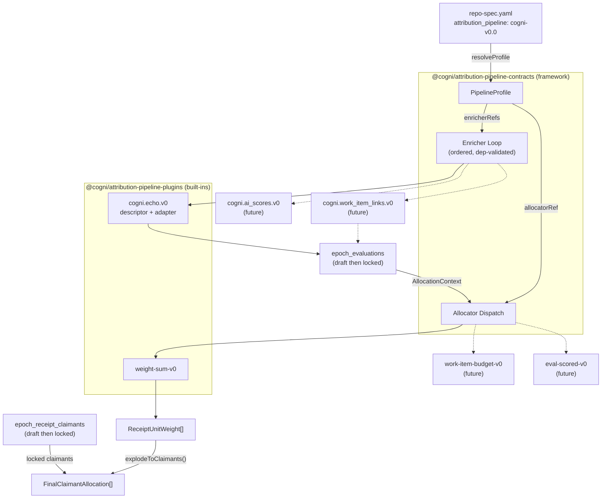
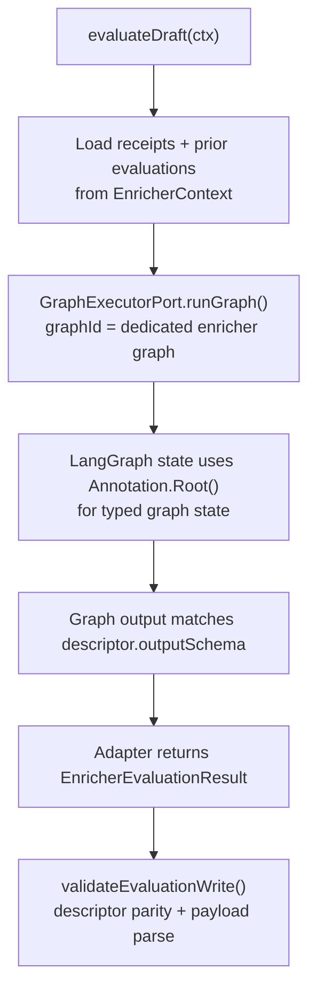

# Plugin Attribution Pipeline: Profile-Based Enricher and Allocator Dispatch

> A **pipeline profile** selects which enricher plugins run and which allocation algorithm computes credit. Profiles are plain data keyed by `attribution_pipeline` from `repo-spec.yaml`. Adding a new enricher or allocator means writing a descriptor + adapter in the plugins package and registering it in a profile — no switch/case editing, no hardcoded wiring, no touching the framework. The framework package (`@cogni/attribution-pipeline-contracts`) is boring and stable; the plugins package (`@cogni/attribution-pipeline-plugins`) is where iteration happens.

### Key References

|              |                                                                                           |                                                  |
| ------------ | ----------------------------------------------------------------------------------------- | ------------------------------------------------ |
| **Overview** | [attribution-pipeline-overview](./attribution-pipeline-overview.md)                       | End-to-end pipeline map (start here)             |
| **Project**  | [proj.transparent-credit-payouts](../../work/projects/proj.transparent-credit-payouts.md) | Project roadmap                                  |
| **Spec**     | [attribution-ledger](./attribution-ledger.md)                                             | Core domain: store port, hashing, statement math |
| **Spec**     | [packages-architecture](./packages-architecture.md)                                       | Package boundary rules                           |
| **Research** | [attribution-scoring-design](../research/attribution-scoring-design.md)                   | LLM evaluation design, quarterly review model    |
| **Spec**     | [identity-model](./identity-model.md)                                                     | actor_id future evolution (orthogonal)           |

## Design

### Pipeline Dispatch Flow



### Two-Package Split

The plugin system is split into two packages with a clear stability boundary:

**`@cogni/attribution-pipeline-contracts`** — Framework. Boring, stable, no I/O. Defines contracts (port interfaces), registries, dispatch logic, ordering/dependency validation, and canonical hashing helpers. A customer implementing a custom plugin depends _only_ on this package. Changes here are rare and require careful versioning.

**`@cogni/attribution-pipeline-plugins`** — Implementations. This is where churn happens. Houses all built-in plugin implementations (descriptor + adapter per plugin) and built-in profile definitions. New enrichers, new allocators, new profiles — all land here. Depends on the framework package for contracts.

**Dependency direction:** `attribution-pipeline-plugins → attribution-pipeline-contracts → attribution-ledger`. Never reverse.

```
packages/attribution-pipeline-contracts/    # framework — stable contracts
├── AGENTS.md
├── package.json            # @cogni/attribution-pipeline-contracts
├── tsconfig.json           # composite, references @cogni/attribution-ledger
├── tsup.config.ts
├── src/
│   ├── index.ts            # public barrel
│   ├── enricher.ts         # EnricherDescriptor, EnricherAdapter port, EnricherContext
│   ├── allocator.ts        # AllocatorDescriptor, AllocationContext, dispatchAllocator()
│   ├── profile.ts          # PipelineProfile, ProfileRegistry, resolveProfile()
│   ├── ordering.ts         # enricher dependency validation, cycle detection
│   └── validation.ts       # evaluation write validation (required refs, descriptor parity, payload schema parse)
└── tests/
    ├── profile.test.ts
    ├── allocator.test.ts
    ├── ordering.test.ts
    └── validation.test.ts

packages/attribution-pipeline-plugins/      # built-in implementations — churn lives here
├── AGENTS.md
├── package.json            # @cogni/attribution-pipeline-plugins
├── tsconfig.json           # composite, references @cogni/attribution-pipeline-contracts
├── tsup.config.ts
├── src/
│   ├── index.ts            # public barrel (re-exports all plugin registrations)
│   ├── plugins/
│   │   ├── echo/
│   │   │   ├── descriptor.ts       # EchoPayload type, buildEchoPayload(), constants
│   │   │   └── adapter.ts          # EnricherAdapter impl (I/O via injected EnricherContext)
│   │   └── weight-sum/
│   │       └── descriptor.ts       # AllocatorDescriptor wrapping attribution-ledger's weightSumV0
│   ├── profiles/
│   │   └── cogni-v0.0.ts           # built-in weekly activity profile
│   └── registry.ts                 # createDefaultRegistries() → {profiles, enrichers, allocators}
└── tests/
    ├── plugins/
    │   ├── echo/adapter.test.ts
    │   └── weight-sum/descriptor.test.ts
    ├── profiles/cogni-v0.0.test.ts
    └── registry.test.ts
```

### Profile Type

A profile is a plain readonly object, never a class. Keyed by the `attribution_pipeline` value from `repo-spec.yaml`. Profile IDs are semver'd (`cogni-v0.0`, `cogni-v0.1`). Operators upgrade by changing `attribution_pipeline` in `repo-spec.yaml`. Profiles are **never mutated** — publish a new version instead.

```typescript
interface PipelineProfile {
  /** Semver'd profile ID (e.g., "cogni-v0.0"). Immutable once published. */
  readonly profileId: string;

  /** Human-readable label for logging/UI. */
  readonly label: string;

  /**
   * Ordered list of enricher descriptors to run.
   * Order is significant — enrichers execute sequentially in this order.
   * Each entry includes the evaluationRef and optional dependency declarations.
   */
  readonly enricherRefs: readonly EnricherRef[];

  /** The allocation algorithm ref (pinned on epoch at closeIngestion per ALLOCATION_ALGO_PINNED). */
  readonly allocatorRef: string;

  /**
   * Epoch kind discriminator for the epochs table.
   * Default: "activity". Quarterly review: "quarterly_review".
   * Included in EPOCH_WINDOW_UNIQUE to allow overlapping time windows.
   */
  readonly epochKind: string;

  /**
   * Zod schema for user-provided config. If non-null, the profile expects
   * a config file at `.cogni/attribution/<profileId>.yaml` (or .json).
   * null = no user config expected (profile is fully self-contained).
   */
  readonly configSchema: ZodType | null;
}

interface EnricherRef {
  /** Identifies this enricher (e.g., "cogni.echo.v0"). */
  readonly enricherRef: string;

  /**
   * Evaluation refs that must exist before this enricher runs.
   * Dependencies are evaluation outputs, not enricher identities.
   * Empty array = no dependencies, can run first.
   * The framework validates the DAG at profile registration — cycles throw.
   */
  readonly dependsOnEvaluations: readonly string[];
}
```

**Registry and resolution:**

```typescript
type ProfileRegistry = ReadonlyMap<string, PipelineProfile>;

/** Resolve profile or throw. Replaces deriveAllocationAlgoRef(). */
function resolveProfile(
  registry: ProfileRegistry,
  attributionPipeline: string
): PipelineProfile;
```

**Profile lifecycle within an epoch:**

1. `repo-spec.yaml` declares `attribution_pipeline: cogni-v0.0`.
2. At **epoch creation**, the executor resolves the profile, validates the enricher dependency DAG, and stores `profile_id` and the exact `enricher_refs` snapshot on the epoch row (immutable provenance). If `profile.configSchema` is non-null, loads and validates `.cogni/attribution/cogni-v0.0.yaml`.
3. During **`open`**, each enrichment pass re-resolves the profile to get the current `enricherRefs`. Draft evaluations are upserted (overwritten) on each pass. If the operator publishes `cogni-v0.1` and updates `repo-spec.yaml`, the next enrichment pass uses `v0.1`'s enrichers. Orphan drafts from removed enrichers are harmless — they won't be locked at close.
4. At **closeIngestion** (open→review), the profile is resolved one final time. `allocatorRef` is written to `allocation_algo_ref`. Only evaluations matching the current profile's `enricherRefs` are locked. The exact plugin refs used at close are stored on the epoch (EPOCH_PINS_PLUGIN_REFS). After this point, the epoch is immutable.
5. At **finalization** (review→finalized), the locked allocator and evaluations are consumed. No further profile resolution.

**Built-in profiles (defined in `@cogni/attribution-pipeline-plugins`):**

| Profile ID   | enricherRefs      | allocatorRef    | selectionPolicyRef              | epochKind  |
| ------------ | ----------------- | --------------- | ------------------------------- | ---------- |
| `cogni-v0.0` | `[cogni.echo.v0]` | `weight-sum-v0` | `cogni.promotion-selection.v0`  | `activity` |
| `cogni-v0.1` | `[cogni.echo.v0]` | `weight-sum-v0` | `cogni.main-merge-selection.v0` | `activity` |

`cogni-v0.1` is the active profile. It differs from `v0.0` only in selection: `promotion-selection.v0` models a staging→main promotion flow and treats a direct-to-`main` PR as a "release PR" (reference data, **excluded**) — which yields zero claimants on a repo that merges directly to `main`. `main-merge-selection.v0` inverts that: a PR merged to `main` **is** the contribution (reviews on those PRs included for visibility; bots excluded). Switching profiles is the documented upgrade path — publish new, bump `attribution_pipeline` in `repo-spec.yaml`; `v0.0` stays registered for provenance of any epoch created under it.

Future profiles add enricher refs (e.g., `cogni.work_item_links.v0`, `cogni.ai_scores.v0`) and select different allocators (e.g., `work-item-budget-v0`, `eval-scored-v0`). No code changes to the framework or dispatch layer — only new plugin implementations and profile data in the plugins package.

### Enricher Plugin Interface

Defined in `@cogni/attribution-pipeline-contracts` (framework). Implemented in `@cogni/attribution-pipeline-plugins` (built-ins) or in customer code.

**`EnricherDescriptor`** — Pure data. Constants, payload types, and optional pure builder functions. No I/O.

```typescript
interface EnricherDescriptor {
  /** Namespaced evaluation ref (EVALUATION_REF_NAMESPACED from attribution-ledger spec). */
  readonly evaluationRef: string;

  /** Algorithm ref for this enricher. Semver'd (e.g., "echo-v0"). */
  readonly algoRef: string;

  /**
   * Schema ref identifying the payload shape version.
   * Stored on every evaluation write for forward compatibility.
   * Format: "<evaluationRef>/<semver>" (e.g., "cogni.echo.v0/1.0.0").
   */
  readonly schemaRef: string;

  /** Runtime schema for payloadJson emitted by this enricher. */
  readonly outputSchema: ZodType<Record<string, unknown>>;
}
```

Pure payload builder functions are exported alongside the descriptor as named exports (e.g., `buildEchoPayload()`), not as methods on an interface. This keeps the descriptor a plain data object and avoids forcing a common function signature across enrichers with different input shapes.

**`EnricherAdapter`** — Port interface. The contract that all enricher implementations fulfill. Defined in the framework package. Implemented in the plugins package.

```typescript
interface EnricherAdapter {
  /** Descriptor + runtime schema for this enricher. */
  readonly descriptor: EnricherDescriptor;

  /**
   * Produce a draft evaluation for the given epoch.
   * Called during the enrichment phase (epoch is open).
   * May perform I/O: read from a scoped store view, call external APIs, invoke LLMs.
   * Must return a complete UpsertEvaluationParams with status='draft'.
   */
  evaluateDraft(ctx: EnricherContext): Promise<UpsertEvaluationParams>;

  /**
   * Produce a locked (final) evaluation for epoch close.
   * Called during closeIngestion. Same contract as evaluateDraft but
   * returns status='locked'. The caller writes atomically.
   */
  buildLocked(ctx: EnricherContext): Promise<UpsertEvaluationParams>;
}

interface EnricherContext {
  readonly epochId: bigint;
  readonly nodeId: string;
  readonly attributionStore: EvaluationStore & SelectionReader;
  readonly logger: Logger;
  /** User-provided config parsed from .cogni/attribution/<profileId>.yaml, or null. */
  readonly profileConfig: Record<string, unknown> | null;
}
```

`EnricherContext.attributionStore` is intentionally scoped. Enrichers receive only evaluation read/write capabilities and read-only selection queries — no selection writes, no identity resolution, no epoch mutations.

**`UpsertEvaluationParams`** must include `evaluationRef`, `algoRef`, `inputsHash`, `schemaRef`, and `payloadHash`. The framework validates those fields, verifies descriptor parity, and parses `payloadJson` with the enricher's `outputSchema` on every evaluation write (EVALUATION_WRITE_VALIDATED).

**Adapter registry** — The executor resolves adapters by `evaluationRef`:

```typescript
type EnricherAdapterRegistry = ReadonlyMap<string, EnricherAdapter>;
```

The executor iterates `profile.enricherRefs` in declared order (respecting `dependsOnEvaluations`), resolves each from the registry, and calls `evaluateDraft()` or `buildLocked()`. The executor owns no enricher-specific logic.

### Allocator Interface

Defined in `@cogni/attribution-pipeline-contracts` (framework). Implemented in `@cogni/attribution-pipeline-plugins` (built-ins).

```typescript
interface AllocatorDescriptor {
  /** Algorithm ref (matches what gets pinned on epoch at closeIngestion). */
  readonly algoRef: string;

  /**
   * Evaluation refs this allocator requires. Empty = no evaluations needed.
   * dispatchAllocator() validates all required refs are present before calling compute().
   */
  readonly requiredEvaluationRefs: readonly string[];

  /**
   * Compute per-receipt weight allocations. Async to support future allocators
   * that may need I/O (e.g., LLM-scored). Deterministic allocators simply
   * return a resolved promise.
   */
  readonly compute: (
    context: AllocationContext
  ) => Promise<ReceiptUnitWeight[]>;

  /** Runtime schema for allocator output. */
  readonly outputSchema: ZodType<ReceiptUnitWeight[]>;
}

interface AllocationContext {
  /** Receipt-scoped input — no userId, no claimant awareness. */
  readonly receipts: readonly ReceiptForWeighting[];
  readonly weightConfig: Record<string, number>;
  /**
   * Locked evaluation payloads keyed by evaluationRef.
   * weight-sum-v0 ignores this; future allocators consume it.
   */
  readonly evaluations: ReadonlyMap<string, Record<string, unknown>>;
  /** User-provided config, or null if profile has no configSchema. */
  readonly profileConfig: Record<string, unknown> | null;
}
```

`dispatchAllocator()` resolves the allocator by `allocatorRef`, validates required evaluations are present, calls `compute()`, and parses the result with the descriptor's `outputSchema`. Output mismatch throws:

```typescript
async function dispatchAllocator(
  registry: AllocatorRegistry,
  allocatorRef: string,
  context: AllocationContext
): Promise<ReceiptUnitWeight[]>;
```

The `weight-sum-v0` descriptor (in the plugins package) wraps `computeReceiptWeights("weight-sum-v0", receipts, weightConfig)` from `@cogni/attribution-ledger`, returning the result as a resolved promise. Allocators produce per-receipt weights; the caller joins with locked claimants via `explodeToClaimants()` to produce per-claimant allocations.

### AI Enricher Pattern

A LangGraph-backed enricher still implements the same `EnricherAdapter` contract. The framework and Temporal workflow do not branch for AI enrichers.



Design rules:

- The adapter remains the only place that knows an enricher is AI-backed.
- `evaluateDraft()` and `buildLocked()` may inject `GraphExecutorPort` the same way they inject store and logger dependencies today.
- The graph owns its internal typed state via `Annotation.Root()`. The adapter owns conversion from graph output to `EnricherEvaluationResult`.
- The graph's terminal output must match the enricher descriptor's `outputSchema`. The framework then validates the returned `payloadJson` the same way it validates any other enricher.
- Billing, observability, streaming, and provider routing stay inside `GraphExecutorPort.runGraph()`. The outer epoch workflow still sees a plain enricher adapter call.
- The worker remains generic: a future AI enricher is registered in the plugins package and selected by profile, not hardcoded into scheduler-worker.

### Enricher Ordering and Dependency Validation

Defined in `@cogni/attribution-pipeline-contracts/src/ordering.ts` (framework).

Enricher execution order is **explicit**, not implicit. Each `EnricherRef` in a profile declares its `dependsOnEvaluations[]` — the evaluation refs that must exist before it runs. The framework validates the dependency graph at profile registration time:

1. **Cycle detection** — topological sort of `dependsOnEvaluations` edges. Cycles throw at registration, not at runtime.
2. **Missing ref detection** — every `dependsOnEvaluations` entry must reference an `enricherRef` that exists in the same profile's `enricherRefs`. Dangling refs throw at registration.
3. **Execution order** — the executor runs enrichers in the order declared by `enricherRefs`, which must be a valid topological order of the dependency graph. If the declared order violates dependencies, registration throws.

For `cogni-v0.0`, echo is the only enricher with empty `dependsOnEvaluations`. Claimant resolution is a separate first-class pipeline phase (via `epoch_receipt_claimants` table), not an enricher. Future profiles with cross-enricher dependencies (e.g., `ai_scores` depends on `work_item_links`) declare them explicitly.

### Quarterly Review — Same Lifecycle, Different Profile

A quarterly review epoch is **not** a special epoch type with its own lifecycle. It follows the same three-phase lifecycle (`open → review → finalized`) as a weekly activity epoch. The differences are entirely in the profile:

| Dimension      | Weekly Activity (`cogni-v0.0`)     | Quarterly Review (`cogni-quarterly-v0.0`)  |
| -------------- | ---------------------------------- | ------------------------------------------ |
| `epochKind`    | `"activity"`                       | `"quarterly_review"`                       |
| `enricherRefs` | echo                               | (future: peer_assessment)                  |
| `allocatorRef` | `weight-sum-v0`                    | `weight-sum-v0` (or future dedicated algo) |
| Epoch window   | 7 days, Monday-aligned             | ~90 days, quarter-aligned                  |
| Weight config  | per-event-type weights             | different weight schema                    |
| Receipts       | From source adapters (GitHub, etc) | From governance input or none              |

The `epoch_kind` column allows a quarterly review epoch and a weekly activity epoch to overlap the same time window without violating `EPOCH_WINDOW_UNIQUE`:

```sql
ALTER TABLE epochs ADD COLUMN epoch_kind TEXT NOT NULL DEFAULT 'activity';
-- EPOCH_WINDOW_UNIQUE becomes:
UNIQUE(node_id, scope_id, period_start, period_end, epoch_kind)
```

The workflow passes `profile.epochKind` when creating the epoch. No branching in the epoch lifecycle code.

### Boundary Summary

- **`packages/attribution-ledger/`** — Pure domain. Owns `AttributionStore`, hashing, statement math, `claimant-shares.ts` (`explodeToClaimants()`), `allocation.ts` (`computeReceiptWeights()`). Never imports from either pipeline package (PLUGIN_NO_LEDGER_CORE_LEAK).
- **`packages/attribution-pipeline-contracts/`** — **Framework.** Boring, stable, no I/O. Owns all plugin contracts (`EnricherAdapter`, `AllocatorDescriptor`, `PipelineProfile`), registries, dispatch logic, ordering/dependency validation, and evaluation write validation. Customers depend on this package to write custom plugins. Changes here are rare and versioned carefully.
- **`packages/attribution-pipeline-plugins/`** — **Built-in implementations.** This is where churn happens. Owns all built-in plugin implementations (descriptor + adapter per plugin), built-in profile definitions, and `createDefaultRegistries()`. Depends on the framework package for contracts. New enrichers, allocators, and profiles land here.
- **Executor (`services/scheduler-worker/`)** — Runtime shell. Imports registries from the plugins package (or builds custom ones). Wires `EnricherContext` with live dependencies (store, logger, nodeId). Executes the profile's enricher loop and allocator dispatch. Persists results. Contains **zero plugin-specific code** (EXECUTOR_IS_GENERIC).

## Goal

Provide a plugin architecture for the attribution pipeline that supports three use cases:

1. **Internal iteration** — Cogni developers rapidly add new enrichers, allocation algorithms, and pipeline versions by writing a descriptor + adapter in the plugins package and publishing a new profile. No switch/case editing, no touching the framework, no modifying the epoch lifecycle.
2. **Customer extensibility** — A customer installs the Cogni review app, creates a `repo-spec.yaml`, and either chooses a built-in profile or implements a custom enricher/allocator against the stable interfaces from `@cogni/attribution-pipeline-contracts` (the framework — not the plugins package).
3. **Many pipelines, safe evolution** — Multiple profiles can coexist (weekly activity, quarterly review, custom). Epochs pin exact plugin refs at close. New profile versions don't retroactively change closed epochs. Determinism is enforced by hashing inputs + plugin version.

## Non-Goals

- **`actor_id` integration** — The pipeline dispatches plugins and produces `ReceiptUnitWeight[]` (per-receipt, not per-user). Claimant resolution via `epoch_receipt_claimants` already supports identity-keyed claimants. When `actor_id` lands (see [identity-model spec](./identity-model.md)), claimant keys can resolve to actor-backed subjects. Orthogonal concern.
- **Quarterly review evaluation payload design** — The people-centric assessment model (what the LLM evaluates, what governance inputs look like) requires a dedicated research spike. This spec defines how quarterly review _dispatches_ via a different profile, not what the enricher _produces_.
- **Source adapter plugin interface** — Already defined in [attribution-ledger spec](./attribution-ledger.md#source-adapter-interface). Source adapters are a separate plugin surface.
- **LLM evaluation prompt engineering** — Implementation detail of the `cogni.ai_scores.v0` enricher adapter, not a pipeline architecture concern.

## Invariants

### Framework Invariants (enforced by `@cogni/attribution-pipeline-contracts`)

| Rule                          | Constraint                                                                                                                                                                                                                                                                                                                                                                     |
| ----------------------------- | ------------------------------------------------------------------------------------------------------------------------------------------------------------------------------------------------------------------------------------------------------------------------------------------------------------------------------------------------------------------------------ |
| PROFILE_IS_DATA               | A `PipelineProfile` is a plain readonly object. No classes, no methods, no I/O. Constructed at import time, registered in a `ReadonlyMap`.                                                                                                                                                                                                                                     |
| PROFILE_IMMUTABLE_PUBLISH_NEW | Profiles are semver'd and **never mutated** after publication. To change enricher composition or allocator selection, publish a new profile version (e.g., `cogni-v0.0` → `cogni-v0.1`). Operators upgrade by changing `attribution_pipeline` in `repo-spec.yaml`.                                                                                                             |
| PROFILE_SELECTS_ENRICHERS     | The profile's `enricherRefs` array is the **sole authority** for which enrichers run during an epoch. The executor iterates this array and dispatches to the matching `EnricherAdapter`. Adding a new enricher to a pipeline = adding its ref to a new profile version.                                                                                                        |
| PROFILE_SELECTS_ALLOCATOR     | The profile's `allocatorRef` is the **sole authority** for which allocation algorithm runs. Replaces `deriveAllocationAlgoRef()`. The allocator ref is also pinned on the epoch at closeIngestion (per ALLOCATION_ALGO_PINNED in attribution-ledger spec).                                                                                                                     |
| ENRICHER_ORDER_EXPLICIT       | Enricher execution order is declared in the profile's `enricherRefs` array. Each entry may declare `dependsOnEvaluations[]` refs. The framework validates the DAG at profile registration: cycles throw, missing refs throw, declared order must be a valid topological sort. No implicit ordering.                                                                            |
| EVALUATION_WRITE_VALIDATED    | Every evaluation write (draft or locked) must include `evaluationRef`, `algoRef`, `inputsHash`, `schemaRef`, and `payloadHash`. The framework validates required fields, requires the result refs to match the descriptor refs, and parses `payloadJson` with the descriptor `outputSchema`. `schemaRef` identifies the payload shape version (e.g., `"cogni.echo.v0/1.0.0"`). |
| ENRICHER_DETERMINISTIC        | Given the same `(inputs + plugin version)`, an enricher must produce the same `(inputsHash, payloadHash, payloadJson)`. Determinism is enforced by including all relevant inputs in `inputsHash` computation. The `algoRef` + `schemaRef` on the evaluation record identify the exact plugin version that produced it.                                                         |
| ALLOCATOR_NEEDS_DECLARED      | Each `AllocatorDescriptor` declares `requiredEvaluationRefs[]`. `dispatchAllocator()` validates that all required evaluation refs are present in `AllocationContext.evaluations` before calling `compute()`. Missing evaluations throw, not silently degrade. After `compute()`, allocator output must parse against the descriptor `outputSchema`.                            |
| ALLOCATION_CONTEXT_EXTENSIBLE | `AllocationContext` is the single input type for all allocators. New allocators access enricher outputs via `context.evaluations` (a `Map<evaluationRef, payload>`). Context grows by adding optional fields, never by changing the `compute()` signature.                                                                                                                     |
| FRAMEWORK_NO_IO               | The framework package (`@cogni/attribution-pipeline-contracts`) contains zero I/O, zero side effects, zero env reads. It is pure types, pure functions, and validation logic. All I/O lives in adapter implementations (plugins package) or the executor (scheduler-worker).                                                                                                   |

### Boundary Invariants (enforced by package dependencies and dep-cruiser)

| Rule                           | Constraint                                                                                                                                                                                                                                                                                                                        |
| ------------------------------ | --------------------------------------------------------------------------------------------------------------------------------------------------------------------------------------------------------------------------------------------------------------------------------------------------------------------------------- |
| PLUGIN_NO_LEDGER_CORE_LEAK     | `packages/attribution-ledger/` must never import from either pipeline package. Dependency direction: `attribution-pipeline-plugins → attribution-pipeline-contracts → attribution-ledger`. Plugin-specific types (e.g., `WorkItemLinksPayload`, `EchoPayload`) are defined in the plugins package, not in the ledger.             |
| FRAMEWORK_STABLE_PLUGINS_CHURN | The framework package (`@cogni/attribution-pipeline-contracts`) changes rarely — it defines contracts. The plugins package (`@cogni/attribution-pipeline-plugins`) changes often — it houses implementations. A customer depends on the framework to write a plugin; they never need to import from the built-in plugins package. |
| EXECUTOR_IS_GENERIC            | The executor (`services/scheduler-worker/`) contains no plugin-specific logic. It resolves profiles, iterates enricher refs, dispatches to the adapter registry, and calls `dispatchAllocator()`. Adding a new plugin requires zero changes to the executor — only changes to the plugins package.                                |

### Epoch Provenance Invariants (enforced by the executor at write time)

| Rule                         | Constraint                                                                                                                                                                                                                                                                                                                                    |
| ---------------------------- | --------------------------------------------------------------------------------------------------------------------------------------------------------------------------------------------------------------------------------------------------------------------------------------------------------------------------------------------- |
| EPOCH_PINS_PROFILE_REF       | Every epoch stores the `profile_id` (semver'd) used at creation. This is immutable provenance — it records which profile version was active. The profile is re-resolved at each pipeline stage from `repo-spec.yaml`, but the creation-time ref is preserved for audit.                                                                       |
| EPOCH_PINS_PLUGIN_REFS       | At `closeIngestion`, the epoch stores the **exact enricher refs and allocator ref** that were used to produce the locked evaluations and allocation. These are immutable — they record the precise plugin versions that produced this epoch's results. Format: `{enricherRefs: [{evaluationRef, algoRef, schemaRef}], allocatorRef}` as JSON. |
| EPOCH_NEVER_MUTATE_REFS      | Once plugin refs are pinned on an epoch (at close), they are never updated. Publishing a new profile version does not retroactively change closed epochs. To recompute, create a new epoch with the new profile.                                                                                                                              |
| CONFIG_VALIDATED_AT_CREATION | If a profile declares `configSchema`, the executor loads `.cogni/attribution/<profileId>.yaml`, validates against the Zod schema, and rejects epoch creation on validation failure. The validated config is passed to all plugins via `profileConfig` on `EnricherContext` and `AllocationContext`.                                           |

### Schema

**Table: `epochs`** — Add columns:

| Column               | Type  | Constraints                 | Description                                                                                                                                         |
| -------------------- | ----- | --------------------------- | --------------------------------------------------------------------------------------------------------------------------------------------------- |
| `profile_id`         | TEXT  | NOT NULL                    | Semver'd profile ID recorded at epoch creation (immutable provenance).                                                                              |
| `epoch_kind`         | TEXT  | NOT NULL DEFAULT 'activity' | Pipeline kind discriminator derived from profile. Application-validated (no DB CHECK — new kinds don't require migrations).                         |
| `locked_plugin_refs` | JSONB | NULL                        | Exact plugin refs pinned at closeIngestion. NULL while epoch is open. Set once at close, never mutated. JSON: `{enricherRefs: [...], allocatorRef}` |

**Table: `epoch_evaluations`** — Add column:

| Column       | Type | Constraints | Description                                                                                               |
| ------------ | ---- | ----------- | --------------------------------------------------------------------------------------------------------- |
| `schema_ref` | TEXT | NOT NULL    | Payload shape version (e.g., `"cogni.echo.v0/1.0.0"`). Enables forward-compatible payload interpretation. |

**Index changes:**

- `EPOCH_WINDOW_UNIQUE` becomes `UNIQUE(node_id, scope_id, period_start, period_end, epoch_kind)` — allows different epoch kinds to overlap the same time window.
- `ONE_OPEN_EPOCH` becomes `UNIQUE(node_id, scope_id, epoch_kind) WHERE status = 'open'` — allows one open epoch per kind per scope.

### File Pointers

| File                                                                | Purpose                                                                        |
| ------------------------------------------------------------------- | ------------------------------------------------------------------------------ |
| `packages/attribution-pipeline-contracts/src/profile.ts`            | PipelineProfile type, ProfileRegistry, resolveProfile()                        |
| `packages/attribution-pipeline-contracts/src/enricher.ts`           | EnricherDescriptor + EnricherAdapter port interface + EnricherContext          |
| `packages/attribution-pipeline-contracts/src/allocator.ts`          | AllocatorDescriptor, AllocationContext, dispatchAllocator()                    |
| `packages/attribution-pipeline-contracts/src/ordering.ts`           | Enricher dependency DAG validation, cycle detection                            |
| `packages/attribution-pipeline-contracts/src/validation.ts`         | Evaluation write validation (required fields, descriptor parity, schema parse) |
| `packages/attribution-ledger/src/claimant-shares.ts`                | `explodeToClaimants()` — joins receipt weights × locked claimants              |
| `packages/attribution-pipeline-plugins/src/plugins/*/descriptor.ts` | Per-plugin pure constants, types, builder functions                            |
| `packages/attribution-pipeline-plugins/src/plugins/*/adapter.ts`    | Per-plugin EnricherAdapter implementations (I/O via injected deps)             |
| `packages/attribution-pipeline-plugins/src/profiles/*.ts`           | Built-in profile definitions                                                   |
| `packages/attribution-pipeline-plugins/src/registry.ts`             | createDefaultRegistries() — assembles all built-in plugins + profiles          |
| `packages/attribution-ledger/src/allocation.ts`                     | Existing allocator implementations (wrapped by plugin descriptors)             |
| `.cogni/repo-spec.yaml`                                             | `attribution_pipeline` field that selects the profile                          |

## Open Questions

- [x] **Claimant-shares finalization path:** ~~Should finalization go through the pipeline dispatch?~~ Resolved: finalization dispatches the pinned allocator via the plugin registry, then applies subject overrides and `explodeToClaimants()` using locked claimant rows. Claimant resolution remains a first-class pipeline phase via `epoch_receipt_claimants`.
- [ ] **Customer-authored plugins:** When a customer wants to bring their own enricher/allocator implementation (not just config), how does our service discover and execute it safely? Deferred — config-driven customization via `.cogni/attribution/` covers the near-term need. Code-level extensibility requires a trust/sandbox model.
- [ ] **`schemaRef` format:** Proposed format is `"<evaluationRef>/<semver>"` (e.g., `"cogni.echo.v0/1.0.0"`). Alternative: separate namespace. Need to confirm this doesn't collide with existing evaluation ref naming.

## Related

- [Attribution Ledger Spec](./attribution-ledger.md) — Core domain invariants, evaluation lifecycle, store port
- [Packages Architecture](./packages-architecture.md) — Package boundary rules (NO_SRC_IMPORTS, PURE_LIBRARY)
- [Attribution Scoring Design](../research/attribution-scoring-design.md) — LLM evaluation design, quarterly review model, retrospective value
- [Identity Model](./identity-model.md) — `actor_id` future evolution (orthogonal to plugin dispatch)
- [proj.transparent-credit-payouts](../../work/projects/proj.transparent-credit-payouts.md) — Project roadmap
