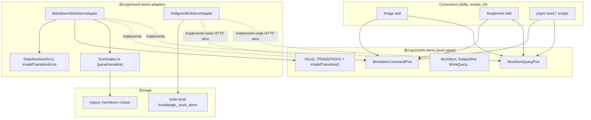
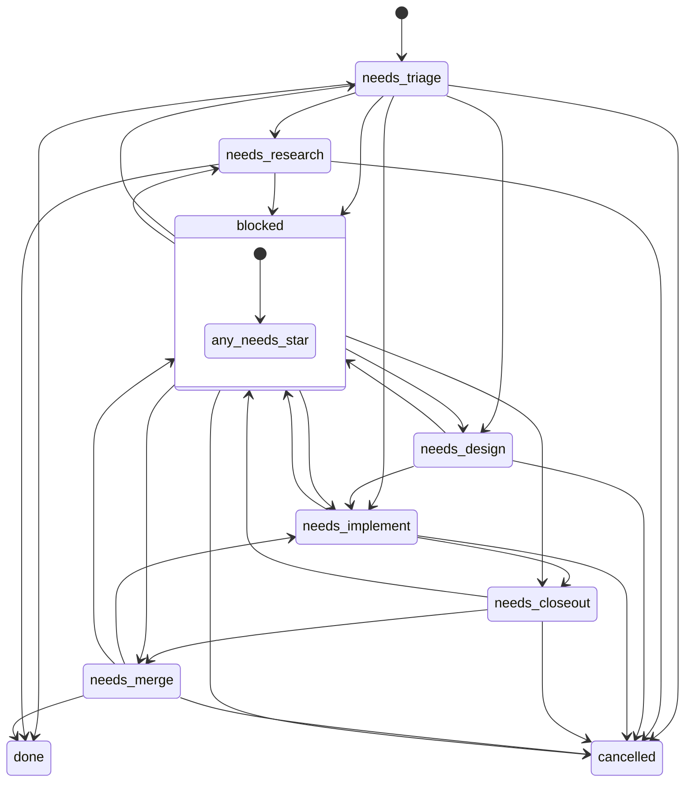

# Work Items Port: Domain Types and Port Interfaces

> Typed port interfaces for reading and writing work items. Every node serves its own Doltgres-backed lifecycle ledger; the markdown adapter remains only for the legacy corpus and local compatibility. All access goes through the port — no direct storage manipulation.

### Key References

|             |                                                                                           |                                   |
| ----------- | ----------------------------------------------------------------------------------------- | --------------------------------- |
| **Project** | [proj.agentic-project-management](../../work/projects/proj.agentic-project-management.md) | Roadmap and planning              |
| **Spec**    | [Development Lifecycle](./development-lifecycle.md)                                       | Status enum and transition rules  |
| **Spec**    | [Identity Model](./identity-model.md)                                                     | Actor kinds for SubjectRef        |
| **Spec**    | [Docs + Work System](./docs-work-system.md)                                               | Frontmatter schema and ID formats |
| **Package** | [`packages/work-items/`](../../packages/work-items/AGENTS.md)                             | Implementation                    |

## Design

### Port Architecture



### Domain Types

All types are `readonly`. The root entry (`@cogni/work-items`) exports pure types with no I/O.

**Identity:**

| Type           | Shape                                                | Purpose                                  |
| -------------- | ---------------------------------------------------- | ---------------------------------------- |
| `WorkItemId`   | `Tagged<string, "WorkItemId">`                       | Branded ID (e.g., `task.0149`, `proj.*`) |
| `Revision`     | `string`                                             | Adapter-specific concurrency token       |
| `WorkItemType` | `"task" \| "bug" \| "story" \| "spike" \| "subtask"` | Item kind                                |

**Assignment and linking:**

| Type           | Shape                                                                                     | Purpose                         |
| -------------- | ----------------------------------------------------------------------------------------- | ------------------------------- |
| `SubjectRef`   | `{ kind: "user", userId } \| { kind: "agent", agentId } \| { kind: "system", serviceId }` | Actor assignment                |
| `ExternalRef`  | `{ system, kind, externalId?, url?, title? }`                                             | Backend-agnostic external link  |
| `RelationType` | `"blocks" \| "parent_of" \| "relates_to" \| "duplicates"`                                 | Canonical relation directions   |
| `WorkRelation` | `{ fromId, toId, type }`                                                                  | Directed relation between items |

**Core entity:** `WorkItem` — 24 fields covering identity, status, assignment, linking, governance locking, and timestamps. See `packages/work-items/src/types.ts` for the full shape.

### Command/Query Separation

**`WorkItemQueryPort`** (read path):

| Method          | Input        | Output                                       |
| --------------- | ------------ | -------------------------------------------- |
| `get(id)`       | `WorkItemId` | `WorkItem \| null`                           |
| `list(query?)`  | `WorkQuery`  | `{ items: WorkItem[], nextCursor?: string }` |
| `listRelations` | `WorkItemId` | `WorkRelation[]`                             |

**`WorkItemCommandPort`** (write path):

| Method              | Key Input                         | Behavior                                   |
| ------------------- | --------------------------------- | ------------------------------------------ |
| `create`            | `type, title, summary?, ...`      | Allocate ID, write, return item            |
| `patch`             | `id, expectedRevision, set`       | Optimistic update of content fields        |
| `transitionStatus`  | `id, expectedRevision, toStatus`  | Validate transition, update status         |
| `setAssignees`      | `id, expectedRevision, assignees` | Overwrite assignees list                   |
| `upsertRelation`    | `fromId, toId, type`              | Add or update relation (no revision check) |
| `removeRelation`    | `fromId, toId, type`              | Remove relation (no revision check)        |
| `upsertExternalRef` | `id, expectedRevision, ref`       | Add or update external ref by system+kind  |
| `claim`             | `id, runId, command`              | Set governance lock (no revision check)    |
| `release`           | `id, runId`                       | Clear governance lock if runId matches     |

> **HTTP wire (v1).** The `patch` command maps to `PATCH /api/v1/work/items/{id}` with body
> `{ "set": { <field>: <value>, ... } }` — the SQL-style `UPDATE … SET` envelope. The operation
> is PATCH but the payload wrapper is **`set`, not `patch`** (mirrors the port's `set` field). v0
> carries no `expectedRevision`. The wrapper is a strict object, so a stray key (e.g. a guessed
> `patch`) 400s with the bad key named rather than being silently ignored. Canonical shape lives in
> `packages/node-contracts/src/work.items.patch.v1.contract.ts`.

### Adapter Contract

Any adapter implementing `WorkItemQueryPort + WorkItemCommandPort` must satisfy:

1. **Optimistic concurrency** — `patch`, `transitionStatus`, `setAssignees`, `upsertExternalRef` reject with a stale-revision error when `expectedRevision` does not match current state.
2. **Transition enforcement** — `transitionStatus` calls `isValidTransition(from, to)` before writing; rejects invalid transitions.
3. **Round-trip safety** — storage-specific metadata not modeled in `WorkItem` is preserved across read-modify-write cycles.
4. **ID allocation** — `create()` produces a unique `WorkItemId` in `<type>.<NNNN>` format.
5. **Body preservation** — adapter writes never modify content outside the adapter's storage domain (e.g., markdown body below frontmatter).

The node HTTP v1 surface deliberately exposes a smaller Doltgres port (`get`, `list`, `create`, `patch`, `delete`) and currently trusts the authenticated caller: it has no optimistic revision check or transition state machine. The Zod wire contracts, not the legacy markdown behavior, are authoritative for that HTTP slice.

### Doltgres Adapter (node ledger)

`@cogni/work-items/adapters/doltgres` is the shared adapter every node wires to its own `knowledge_<slug>` database:

- **Store isolation**: the DSN selects the node; there is no node-routing field or central fallback.
- **ID allocation**: fresh stores default to suffix `0001`; operator passes floor `5000` because its imported legacy corpus occupies lower IDs.
- **Audit**: every create, patch, and delete ends with `dolt_commit('-Am', ...)` carrying the authenticated actor tag.
- **Queries**: keyset pagination uses `(priority, rank, created_at, id)`; no `OFFSET` drift.
- **Protocol**: runtime SQL uses `sql.unsafe()` because Doltgres does not support the postgres.js extended protocol reliably.
- **Ownership**: packages own the adapter; each node owns thin Next.js route/facade/container wiring.

### Markdown Adapter (v0)

The `MarkdownWorkItemAdapter` in `@cogni/work-items/markdown` implements both ports against `work/items/*.md` and `work/projects/*.md`:

- **Revision**: SHA-256 hex digest of the raw YAML frontmatter section
- **ID allocation**: scan all files for max numeric suffix, +1, zero-pad to 4 digits
- **Field mapping**: snake_case frontmatter ↔ camelCase TypeScript (e.g., `spec_refs` ↔ `specRefs`)
- **Assignee compatibility**: plain string in frontmatter → `{ kind: "user", userId }` SubjectRef
- **Error types**: `StaleRevisionError`, `InvalidTransitionError`

### Status Transition Table

Derived from `development-lifecycle.md`. Encoded in `VALID_TRANSITIONS` map and enforced by `isValidTransition()`.



## Goal

Enable agents and scripts to manage node-local work items through typed port interfaces and machine-discoverable HTTP contracts instead of hand-editing YAML frontmatter.

## Non-Goals

- External tracker adapters
- UI for work item management (future — project P2)
- Governance runner dispatch integration (future — project P2)
- Cross-node ID allocation or a central work-item ledger

## Invariants

| Rule                     | Constraint                                                                                        |
| ------------------------ | ------------------------------------------------------------------------------------------------- |
| COMMAND_QUERY_SEPARATION | Reads via `WorkItemQueryPort`, writes via `WorkItemCommandPort`. No mixed interfaces.             |
| OPTIMISTIC_CONCURRENCY   | Every content-mutating write checks `expectedRevision`; rejects on mismatch.                      |
| TRANSITION_ENFORCEMENT   | `transitionStatus()` validates against `VALID_TRANSITIONS`; rejects invalid transitions.          |
| ROUND_TRIP_SAFE          | Unknown storage-specific metadata preserved across read-modify-write cycles.                      |
| BODY_PRESERVED           | Adapter writes never modify content outside the adapter's domain (markdown body, etc.).           |
| CANONICAL_RELATIONS      | Relations store canonical direction only (`blocks`, `parent_of`). Inverses derived at query time. |
| ACTOR_KINDS_ALIGNED      | `SubjectRef` kinds (`user`, `agent`, `system`) match identity-model.md actor kinds.               |
| ID_ALLOC_UNIQUE          | `create()` allocates a unique `WorkItemId`. Collision is a bug.                                   |
| NO_APP_IMPORTS           | `@cogni/work-items` imports nothing from `@/`, `src/`, or app/service code.                       |
| CONTRACT_TESTS_PORTABLE  | The contract test suite runs against any adapter via factory parameterization.                    |

### File Pointers

| File                                                            | Purpose                                                      |
| --------------------------------------------------------------- | ------------------------------------------------------------ |
| `packages/work-items/src/types.ts`                              | Domain types (`WorkItem`, `SubjectRef`, `WorkQuery`)         |
| `packages/work-items/src/ports.ts`                              | Port interfaces (`WorkItemQueryPort`, `WorkItemCommandPort`) |
| `packages/work-items/src/transitions.ts`                        | `VALID_TRANSITIONS` map + `isValidTransition()`              |
| `packages/work-items/src/index.ts`                              | Root barrel (pure types, no I/O)                             |
| `packages/work-items/src/adapters/markdown/adapter.ts`          | `MarkdownWorkItemAdapter` implementation                     |
| `packages/work-items/src/adapters/markdown/frontmatter.ts`      | Parse/serialize YAML frontmatter, compute SHA-256            |
| `packages/work-items/src/adapters/markdown/errors.ts`           | `StaleRevisionError`, `InvalidTransitionError`               |
| `packages/work-items/src/adapters/markdown/index.ts`            | Adapter barrel                                               |
| `packages/work-items/src/adapters/doltgres/adapter.ts`          | Shared node-local Doltgres implementation                    |
| `packages/work-items/src/adapters/doltgres/ports.ts`            | HTTP slice port and inferred input types                      |
| `packages/work-items/src/adapters/doltgres/index.ts`            | Curated Doltgres adapter barrel                               |
| `packages/work-items/tests/contract/work-item-port.contract.ts` | Portable contract test suite                                 |

## Acceptance Checks

```bash
# All 16 contract tests pass
pnpm vitest run packages/work-items/tests/

# Package builds with dual entry points
pnpm --filter @cogni/work-items build

# Type-checks clean
pnpm --filter @cogni/work-items typecheck

# Full CI gate
pnpm check
```

## Open Questions

None.

## Related

- [Development Lifecycle](./development-lifecycle.md) — status enum, command dispatch, transition rules
- [Identity Model](./identity-model.md) — actor kinds that `SubjectRef` aligns with
- [Docs + Work System](./docs-work-system.md) — frontmatter schema, ID conventions, content boundaries
- [Packages Architecture](./packages-architecture.md) — package conventions, capability package shape
