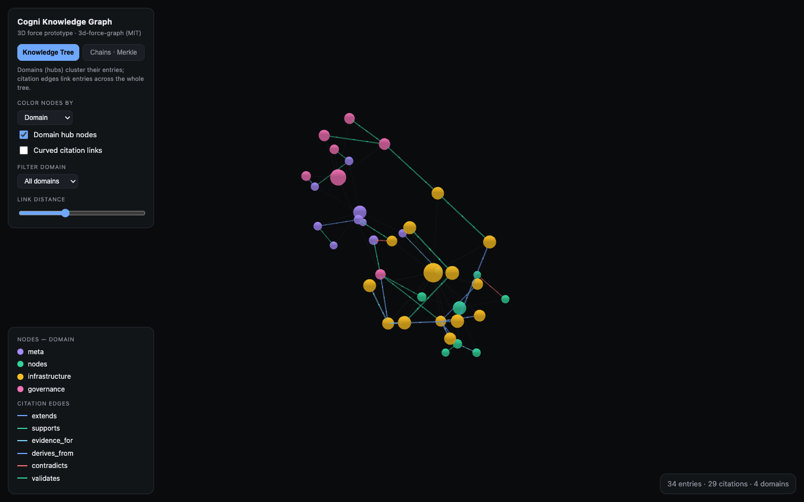
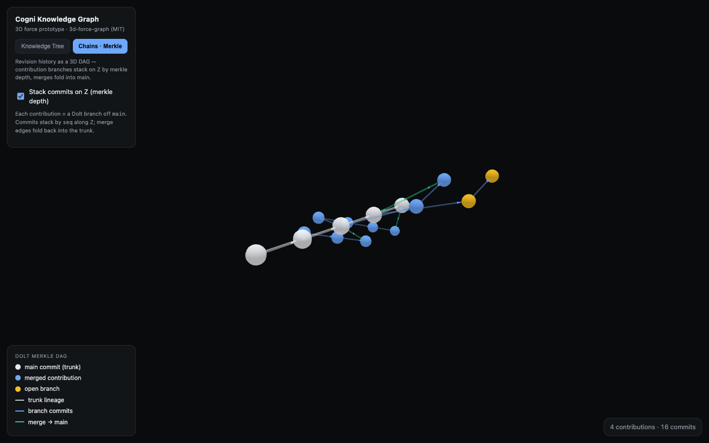

# Knowledge graph — 3D viz prototype

Research + working prototype for visualizing the Cogni knowledge hub (`/knowledge`) as a 3D graph.
**Open `index.html` in any browser** — zero build, no auth, no deploy. Drag to rotate, scroll to zoom, click a node for detail.

## Two views

- **Knowledge Tree** — domains are hub nodes; entries cluster around their domain; `citations` are typed edges (supports / extends / supersedes / contradicts / evidence_for / validates …, colored to match `ChainPanel.tsx`). Color nodes by domain / entry-type / confidence / source; filter by domain; adjust link distance.
- **Chains · Merkle** — the Dolt revision history as a 3D DAG. The `main` lineage is the white spine receding along **Z**; each `contribution` branch fans out in X/Y and each commit advances one Z step (merkle depth); merges fold back into the trunk (green); an unmerged branch stays open (amber). Toggle "Stack commits on Z" to collapse to a flat 2D DAG.

## Library decision

**`3d-force-graph` (vasturiano, MIT)** — Three.js/WebGL force-directed 3D. Only mature, MIT, React-friendly lib that does **both** a 3D force graph _and_ fixed-Z DAG layering (`dagMode:'zin'` + per-node `fz`) — the lever for "chains as a dimension." React binding: `react-force-graph-3d` (import via `next/dynamic {ssr:false}` — it touches `window`).

Runners-up: **Reagraph** (Apache-2.0, React-first, batteries-included clustering — good if we want less Three.js wiring); **Sigma.js + graphology** (MIT, 100k+ nodes but **2D only** — reach for it only if scale forces us off 3D). Cosmograph's React wrapper is **CC-BY-NC** (non-commercial) — avoid; only its MIT `cosmos` engine is usable. Full matrix in the chat thread.

## Gotcha (cost us the first render)

The standalone `3d-force-graph` bundle **already includes THREE** — do **not** also load `three.js` separately (double-THREE breaks the layout engine). And don't call `d3ReheatSimulation()` synchronously at init before the engine's first tick (throws `reading 'tick'`); set `d3Force('link').distance()` _before_ `graphData()` instead.

## Wiring to real data (when productionized)

Data here is mock, shaped to the real schema. To go live:

- **Nodes + domains** → `GET /api/v1/knowledge` (`{ items: KnowledgeRow[], domains }`, session-cookie auth).
- **Edges** → no full-citations list endpoint exists yet; either add one (`citations` table: `citingId, citedId, citationType`) or walk `GET /api/v1/edo/chain/:id` (depth-limited).
- **Chains/merkle** → `GET /api/v1/knowledge/contributions` + `/contributions/:id/commits` (`branch, baseCommit, headCommit, commitHash, seq`), or Dolt `dolt_log()`.
- Natural home: a 4th view-mode button (`?mode=graph`) next to Browse / Chains / Domains / Inbox in `nodes/canary/app/src/app/(app)/knowledge/view.tsx`.
